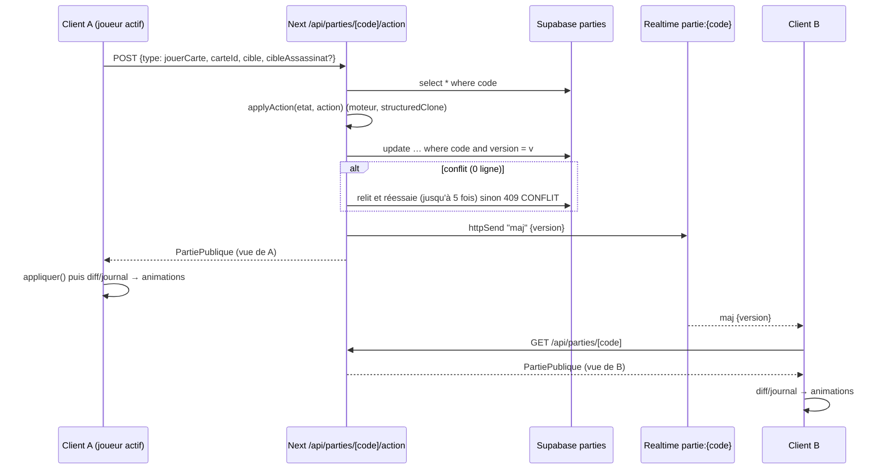

# Courtisans Online : architecture, intentions et pièges

Ce document décrit ce que le code ne dit pas : pourquoi il est organisé ainsi, ce qui a été réglé à la main, où sont les pièges, et comment en tirer des briques `@pgo/*` réutilisables par d'autres jeux de cartes (Skull King, Flip 7, Love Letter, Hanabi, Skyjo…).

Conventions de ce document :

- `web/…` désigne `games/courtisans/apps/web/src/…`
- `engine/…` désigne `games/courtisans/packages/engine/src/…`
- `studio/…` désigne `games/courtisans/apps/studio/…`
- Les noms de fonctions sont entre backticks et suivis de `()`. Les réglages Leva sont cités avec leur dossier (« Deck », « Draw Pile »…).
- Le code de Courtisans est **en français** (identifiants, fichiers, routes `/api/parties`). Le template et `@pgo/core` sont **en anglais** (`/api/games`, `players`, `view`). Toute la section 7 parle de cet écart.

État au moment de la rédaction (commit `392e07b`) : `apps/web` est encore autonome et importe `@courtisans/engine` ; seul le moteur est branché sur `@pgo/engine-kit` via `engine/game.ts` (`GAME`). `apps/web` n'utilise pas encore `@pgo/core`.

---

## Sommaire

1. [Vue d'ensemble](#1-vue-densemble)
2. [Moteur](#2-moteur)
3. [Serveur et temps réel](#3-serveur-et-temps-réel)
4. [Scène 3D](#4-scène-3d)
5. [UI hors 3D](#5-ui-hors-3d)
6. [Sanity](#6-sanity)
7. [Classement générique / configurable / spécifique et API proposée](#7-classement-et-api-proposée)
8. [Dette et pièges](#8-dette-et-pièges)

---

## 1. Vue d'ensemble

### 1.1 Principes

- **Le serveur est la seule source de vérité.** L'état complet (`GameState`, avec la pioche, les mains et les missions de tous) vit dans la colonne `etat` de la table Supabase `parties`. Il n'est jamais envoyé au client. Chaque joueur reçoit uniquement `vueJoueur(etat, joueurId)` (`engine/view.ts`).
- **Les règles vivent uniquement dans le moteur** (`packages/engine`, TypeScript pur, sans React ni Next). Le client ne fait que *pré-filtrer* ce qui est cliquable (`zonesDisponibles` vient de la vue). Il ne valide rien.
- **Le temps réel est un simple « ping ».** Après chaque écriture, le serveur diffuse `maj {version}` sur le canal `partie:{code}`, puis chaque client refait un `GET`. Aucune donnée de jeu ne transite par le canal.
- **Sanity est un catalogue de contenu** (images, textes, missions), jamais une source de règles, à une exception près : les **conditions des missions** sont modélisées dans Sanity puis converties en `Condition` moteur (`web/server/missions.ts`, `versCondition()`).
- **Tout a une valeur par défaut locale.** Si Sanity tombe, `getCatalogueClient()` renvoie `CATALOGUE_PAR_DEFAUT` (assets dans `web/public`) et `chargerMissions()` complète avec `MISSIONS_PROVISOIRES`. Le jeu reste jouable sans Sanity.

### 1.2 Parcours joueur, étape par étape

#### Accueil (`/`)

| Couche | Ce qui se passe |
|---|---|
| Client | `web/app/page.tsx` (RSC, `revalidate = 60`, JSON-LD `VideoGame`) rend `Accueil` (`web/components/accueil/accueil.tsx`). Le profil vient de `useProfil()` (`web/lib/profil.ts`, `useSyncExternalStore` sur le localStorage `courtisans:profil`, soit `{pseudo, chateau}`). Le champ « Vôtre prénommée » (`ChampAppellation`, `web/components/banquet/ecran-banquet.tsx`) met en majuscules et coupe à 20 caractères. Le code est saisi dans `ChampCode` (InputOTP 6 cases, `REGEXP_ONLY_DIGITS_AND_CHARS`). Le bouton unique « Courtiser au banquet » appelle `courtiser()` : **code vide → création**, code de 6 caractères → `router.push('/partie/CODE')`, sinon toast d'erreur. |
| Serveur | `creer()` → `api.creer(profil)` → `POST /api/parties` → `creerPartie()` (`web/server/parties.ts`) : génère un code (`web/server/code.ts`, 6 caractères sans I/O/0/1), pose le cookie joueur (`web/server/joueur.ts`, `courtisans_joueur`, UUID, 30 jours, httpOnly) et insère la ligne (5 essais si collision `23505`). |
| Supabase | `insert` dans `parties` (`statut = 'lobby'`, `joueurs = [hôte]`, `etat = null`, `version = 0`). |
| Sanity | `getCatalogueClient()` est appelé par `web/app/layout.tsx` **et** par `page.tsx` (cache Next `revalidate: 60`, tag `catalogue`, `web/sanity/catalogue.ts`). Il fournit le logo, le décor du banquet, la reine, le motif et le papier (variables CSS `--image-motif` / `--image-papier` posées sur `<html>`), et les règles. |
| Autre | Après la création, le lien est copié dans le presse-papiers (`lienPartie()`, `web/lib/api.ts`) avec le toast « Lien du banquet copié ! ». `EcranOrdinateur` (`web/components/ecran-ordinateur.tsx`) recouvre tout l'écran sous 900 px : **le jeu n'est pas jouable sur mobile**, c'est voulu. |

#### Rejoindre (`/partie/[code]`)

| Couche | Ce qui se passe |
|---|---|
| Client | `web/app/partie/[code]/page.tsx` met le code en majuscules, pose `robots: noindex` et rend `PartieClient` (`web/components/partie/partie-client.tsx`). `usePartie(code)` (`web/lib/use-partie.ts`) charge la partie. Une petite machine à états `autoJoin` (`idle` → `encours` → `echec` \| `manuel`) décide : si je ne suis pas membre (`partie.moiId === null`), que la partie est en lobby **et que j'ai déjà un profil valide enregistré**, je rejoins automatiquement. Sinon (`manuel`), j'ai le formulaire « Rejoindre le banquet ». |
| Serveur | `POST /api/parties/[code]/rejoindre` : ajoute le joueur, ou **met à jour son profil** s'il est déjà dans le lobby. Refus si la partie n'est plus en lobby ou si elle est pleine (`MAX_JOUEURS = 5`, `web/lib/partie-types.ts`). |
| Supabase | `modifierPartie()` (verrou optimiste, voir §3), puis broadcast `maj`. |
| Sanity | Rien de plus que l'accueil. |

Écrans d'erreur, tous dans `EcranBanquet` : partie introuvable, « Ce banquet a déjà commencé » (non-membre et statut ≠ lobby), et un loader tant que `!pret || doitAutoJoin`.

#### Lobby

| Couche | Ce qui se passe |
|---|---|
| Client | `ListeConvives` (`web/components/partie/lobby.tsx`) : couleur de siège `COULEURS_JOUEURS[i]`, couronne de l'hôte (`Couronne`, masque CSS sur `/pictograms/PICTOGRAM_NOBLE.webp`), « (vous) ». `BoutonLobby` : seul l'hôte voit « Ouvrir le banquet », actif à partir de `MIN_JOUEURS = 2`. `ChampCode` en lecture seule, avec un bouton pour copier le lien. |
| Serveur | `POST …/lancer` : hôte uniquement, au moins 2 joueurs. `chargerMissions()` puis `setupPartie()` (`engine/setup.ts`), `statut = 'jeu'`. `POST …/quitter` n'est possible qu'en lobby ; si l'hôte part, l'hôte est transféré au joueur suivant. |
| Supabase | Écriture de `etat`, `statut`, `version + 1` ; broadcast. |
| Sanity | `chargerMissions()` (`web/server/missions.ts`) lit les missions Sanity **côté serveur**, écarte celles dont la condition est invalide et complète chaque couleur avec `MISSIONS_PROVISOIRES` jusqu'au nombre de joueurs. |

#### Lecture des missions (ouverture)

**Piège majeur :** `setupPartie()` démarre directement en `phase: "jeu"`, pas en `"missions"`. La phase `"missions"` existe dans les types et dans `lireMissions()`, mais n'est plus jamais atteinte. L'ouverture est donc pilotée côté client par le drapeau `missionsLues` de chaque joueur.

| Couche | Ce qui se passe |
|---|---|
| Client | `Jeu3D` (`web/components/jeu3d/jeu3d.tsx`) : `aLire(vue)` = pas en fin, je suis joueur et `missionsLues` est faux. L'état `etape` enchaîne `"tapis"` (le tapis se déroule, `dureeTapis` 3,2 s + 0,3 s) → `"distribution"` (distribution carte par carte, `0,1 + n×3×pasDistribution` s + 1,3 s) → `"missions"` (missions face à la caméra ; le bouton `texteBoutonMissions` apparaît après `attenteBouton` = 1,6 s) → `null`. Les minuteries ne démarrent qu'après `onPret` (le Canvas est monté). Le clic sur le bouton appelle `finirIntro()`, qui empile les annonces « banquet » et, si c'est mon tour, « C'est votre tour », puis envoie l'action `lireMissions`. |
| Serveur | `POST …/action {type: "lireMissions"}` → `applyAction()` → `missionsLues = true`. |
| Supabase | Écriture et broadcast. **Tous les joueurs envoient cette action presque en même temps** (voir §3.3 et §8). |
| Sanity | Textes `texts.missionsButton`, `texts.banquetStarts`, `texts.guestsSettling` ; images des missions (`catalogue.missions[id]`) composées avec leur texte en canvas (`composerMission()`, `web/components/jeu3d/textures.ts`). |

Pendant ce temps, le joueur actif peut déjà jouer côté moteur (la phase est `jeu`). En pratique, la couronne et le bandeau ne s'affichent qu'après l'ouverture (`tourAffiche` vaut `null` pendant `tapis`/`distribution`).

#### Partie

| Couche | Ce qui se passe |
|---|---|
| Client | Sélection d'une carte de la main (`it.selectionner`), puis choix d'une cible : colonne haut/bas de la table (`Cible`), domaine personnel ou adverse (`ZoneCliquable`, `Badge` du pseudo, clic sur une carte du domaine). Pour un assassin, une deuxième étape « choisir la victime » (`Assassinat`) s'ouvre, avec le bouton « Ne pas assassiner ». L'envoi passe par `api.action(code, {type: "jouerCarte", carteId, cible, cibleAssassinat?})`. |
| Serveur | `POST …/action` n'accepte que `lireMissions` et `jouerCarte`. `modifierPartie()` → `applyAction()`. Le `statut` SQL est recalculé depuis `etat.phase` (`fin` → `'fin'`). |
| Supabase | Écriture, `version + 1`, broadcast ; les autres clients refont un `GET`. |
| Sanity | Rien de dynamique : les textures sont déjà chargées. |

#### Fin

| Couche | Ce qui se passe |
|---|---|
| Client | `vue.phase === "fin"` et `vue.resultats` présents → `useSequenceFin()` (`web/components/jeu3d/fin.ts`) déroule une chorégraphie d'environ 20 s (voir §4.4) que l'on peut passer (« Passer »). Viennent ensuite l'annonce de victoire (`annonceVainqueur()`), puis le tableau des scores `FinDePartie` (`web/components/jeu/fin-de-partie.tsx`) avec la vignette de partage. |
| Serveur | `finirTour()` met `phase = "fin"` et pousse `finDePartie` ; la route passe le statut SQL à `'fin'`. `vueJoueur()` révèle alors les missions de tous, les espions et `resultats` (`calculerResultats()`). |
| Supabase | `statut = 'fin'`. |
| Sanity | `texts.winnerPhrases` (phrase choisie par un hash déterministe de `code + journal.length`, pour que tout le monde voie la même). |

#### Rejouer

| Couche | Ce qui se passe |
|---|---|
| Client | Bouton « Rejouer (x/n) » dans `FinDePartie` → `api.rejouer()`. Le bouton est désactivé si j'ai déjà voté. |
| Serveur | `web/app/api/parties/[code]/rejouer/route.ts` : vote idempotent. Quand tous ont voté : `setupPartie({joueurs, missions})`, `statut = 'jeu'`, `rejouer = []`. |
| Supabase | Nouvel `etat` dans la même ligne (même code, même lien). |
| Sanity | `chargerMissions(MAX_JOUEURS)` est appelé **à chaque vote**, pas seulement au dernier. |

Côté client, le passage à une nouvelle partie est détecté par le « repère » `phase:joueurActif:aLire` dans `Jeu3D` : quand `aLire` redevient vrai, `etape` repasse à `"tapis"` et l'ouverture complète est rejouée.

### 1.3 Schéma des flux de données

```
                       ┌─────────────────────────── Sanity (projet 2lo2f5sv / production) ──┐
                       │ interface · game · rules · texts · family · role · courtier · mission│
                       └──────────────┬───────────────────────────────┬───────────────────────┘
                   GROQ CATALOGUE_QUERY│ (revalidate 60, tag catalogue) │ GROQ missions (serveur)
                                      ▼                               ▼
┌──────────── Navigateur ────────────┐        ┌──────────── Next.js (Vercel) ─────────────────┐
│ layout/page RSC → CatalogueClient  │◀──HTML─│ getCatalogueClient()  (web/sanity/…)          │
│                                    │        │                                               │
│ usePartie(code)                    │──GET──▶│ /api/parties/[code]  → partiePublique()       │
│   ├─ applique si version > locale  │◀─JSON──│      vueJoueur(etat, cookie)                  │
│   ├─ poll 8 s, refetch au focus    │        │                                               │
│   └─ canal broadcast partie:{code} │        │ POST /api/parties/[code]/action|lancer|…      │
│         « maj {version} » ─────────┼─┐      │   modifierPartie(): lit → applyAction()       │
│                                    │ │      │   → update … where version = v (5 essais)     │
│ Jeu3D / Scene3D (R3F)              │ │      │   → notifier(): httpSend("maj")               │
│   diff vue précédente / nouvelle   │ │      └──────────────┬───────────────▲────────────────┘
│   + journal → animations, sons     │ │                     │ service role  │
└────────────────────────────────────┘ │                     ▼               │
              ▲                        │      ┌──────────── Supabase ────────┴─────────────────┐
              └────── Realtime ────────┴──────│ table parties (RLS sans policy)                │
                 (clé anon/publishable,        │ Realtime broadcast (pas de postgres_changes)   │
                  broadcast uniquement)        └────────────────────────────────────────────────┘
```

Séquence d'un coup :



---

## 2. Moteur

Paquet `packages/engine` (`@courtisans/engine`), testé avec Vitest (`*.test.ts`, dont `simulation.test.ts` qui joue des parties entières). Aucune dépendance runtime, hormis `@pgo/engine-kit` pour l'adaptateur `game.ts`.

### 2.1 Données (`engine/types.ts`, `engine/deck.ts`)

- `FAMILLES` : `papillon, crapaud, rossignol, lievre, cerf, carpe` (6). `ROLES` : `noble, espion, assassin, garde`.
- `Courtisan = { id, famille, role: Role | null }`. Id stable : `${famille}-${role ?? "courtisan"}-${i}`. **Il sert aussi de clé React et de clé d'animation** ; ne jamais le rendre aléatoire.
- Composition par famille (`deck.ts`) : noble ×4, espion ×2, assassin ×2, garde ×3, sans rôle ×4, soit 15 cartes par famille et **90 cartes**.
- `CARTES_ECARTEES = {2: 30, 3: 18, 4: 6, 5: 0}` : cartes retirées face cachée selon le nombre de joueurs (`ecartees`).
- `TAILLE_MAIN = 3`, `POINTS_MISSION = 3`, `poids(carte)` = 2 pour un noble, 1 sinon.
- `Niveau = "haut" | "bas"` (moitié lumière / moitié disgrâce du tapis), `Statut = "lumiere" | "disgrace" | "neutre"`.
- `ZoneJeu = "table" | "domaine" | "domaineAdverse"` : les trois « emplacements » qu'un joueur doit remplir à chaque tour, un de chaque.
- `Cible = {zone: "table", niveau} | {zone: "domaine", joueurId}`. Le domaine adverse est un `domaine` avec un autre `joueurId` ; la distinction se fait dans `zoneDeCible()`.
- `GameState` : `joueurs[]` (`main`, `domaine`, `missions` [1 blanche + 1 bleue], `missionsLues`), `pioche`, `ecartees`, `eliminees`, `table: Placement[]` (`{carte, niveau}` ; la **colonne n'est pas stockée**, elle se déduit de la famille), `joueurActif` (index), `zonesJouees: ZoneJeu[]`, `numeroTour`, `phase`, `journal: Evenement[]`.
- `Evenement` : `carteJouee {joueurId, carte, cible}`, `carteEliminee {joueurId, carte, cible}` (le `joueurId` est l'assassin), `pioche {joueurId, nombre}`, `finDePartie`.

### 2.2 Mise en place (`engine/setup.ts`, `setupPartie()`)

1. Mélange (RNG injectable, `engine/rng.ts` ; `GAME.setup` passe `createRng(seed)` si un `seed` est fourni).
2. Retire `CARTES_ECARTEES[n]` cartes.
3. Distribue 3 cartes à chacun.
4. Tire une mission blanche et une bleue par joueur. Il faut au moins `n` missions de chaque couleur, sinon `EngineError("MISSIONS_INSUFFISANTES")`, d'où le complément côté serveur.
5. `joueurActif` aléatoire.
6. **`phase: "jeu"` directement** (voir §1.2).

### 2.3 Tour et règles (`engine/actions.ts`)

`applyAction(state, action)` commence toujours par un `structuredClone(state)` : le moteur est **pur** vis-à-vis de l'appelant, ce qui permet à `modifierPartie()` de réessayer sans effet de bord.

- `lireMissions(joueurId)` : refusé en fin ; `missionsLues = true` ; si tous ont lu, `phase = "jeu"` (sans effet aujourd'hui, la phase l'est déjà).
- `jouerCarte(joueurId, carteId, cible, cibleAssassinat?)`, dans l'ordre :
  1. phase `jeu`, sinon `PHASE_INVALIDE` ;
  2. c'est bien le joueur actif, sinon `PAS_TON_TOUR` ;
  3. la carte est dans sa main, sinon `CARTE_INCONNUE` ;
  4. `zoneDeCible()` ; la zone n'a pas déjà été jouée ce tour, sinon `ZONE_DEJA_JOUEE` ;
  5. `cibleAssassinat` n'est accepté que pour un assassin, sinon `ASSASSINAT_INVALIDE` ;
  6. la carte est posée (`table.push` ou `domaine.push`) et `carteJouee` est journalisé **avant** l'assassinat, ce qui donne l'ordre des animations ;
  7. assassinat éventuel ;
  8. `zonesJouees.push(zone)` ; le tour se termine si 3 zones ont été jouées **ou** si la main est vide.
- `finirTour()` : pioche `min(3, pioche.length)` cartes pour le joueur qui termine (journal `pioche` seulement si > 0), vide `zonesJouees`, puis cherche le prochain joueur **qui a encore des cartes** (tour de table `+1`). S'il n'y en a aucun : `phase = "fin"` et `finDePartie`. `numeroTour` compte les tours de joueur, pas les tours de table.
- Helpers exportés : `zonesDisponibles(state)`, `joueurActifId(state)` (null hors phase `jeu`), `zoneDeCible()`.

#### Cas limites

- **Assassin** (`assassiner()`) :
  - La victime est cherchée **dans la zone où l'assassin vient d'être posé** : n'importe quelle carte de la table (toutes colonnes et tous niveaux confondus) si l'assassin va à la table, sinon n'importe quelle carte du domaine ciblé (le sien ou celui d'un adversaire).
  - Interdits : la victime est un **garde** ; la victime est l'assassin lui-même.
  - Un **espion caché** peut être assassiné, même dans un domaine où sa famille n'est pas visible : le client propose sa carte de dos.
  - L'assassinat est **optionnel** : un assassin sans `cibleAssassinat` est simplement posé.
  - La victime part dans `eliminees` ; le journal reçoit `carteEliminee` avec la cible d'origine de la victime (`{zone: "table", niveau}` ou la cible du domaine), ce qui permet d'animer le départ depuis le bon endroit.
  - Côté client (`jeu3d.tsx`, `interaction.jouer()`) : si l'assassin n'a **aucun candidat** (zone vide ou uniquement des gardes), l'étape de choix est sautée et la carte est envoyée directement.
- **Garde** : il ne protège que lui-même, pas sa famille. Rien d'autre dans le moteur.
- **Espion** :
  - Dans un domaine, il est vu de dos par **tout le monde, y compris son propriétaire**, jusqu'à la fin (`carteVisible()`, `engine/view.ts`). Il reste lisible dans la main.
  - À la table, il compte **pour sa vraie famille** dans `calculerStatuts()` (poids 1) alors qu'il est affiché dans la colonne de la Reine : c'est une influence cachée voulue.
  - Au décompte, les espions d'un domaine comptent avec leur vraie famille.
- **Zones jouées** : exactement une carte par zone et par tour. Avec 2 cartes en main, le tour se termine après 2 poses, sans obligation de couvrir les 3 zones. La vue expose `zonesDisponibles` ; le client grise le reste (`it.peutJouer(zone)`).
- **Fin de pioche** : la partie ne s'arrête pas quand la pioche est vide. Chacun joue ses dernières cartes, les joueurs à main vide sont sautés, et la fin arrive quand **plus personne** n'a de carte.

### 2.4 Scores et missions (`engine/scoring.ts`, `engine/missions.ts`)

- `calculerStatuts(table)` : pour chaque famille, somme des poids en `haut` et en `bas`. `haut > bas` donne `lumiere`, `bas > haut` donne `disgrace`, l'égalité donne `neutre`.
- `pointsDomaine(domaine, statuts)` : par famille présente, `poids × valeurStatut` (+1 / −1 / 0). Les familles de poids nul sont filtrées de `detail`.
- `calculerResultats(state)` : `total = domaine + 3 × missions validées`, puis tri. `rang = 1 + nombre de joueurs strictement meilleurs` (les ex æquo partagent le rang) ; `vainqueurs` = tous ceux au meilleur total. Il n'y a **pas de départage**.
- Missions : `Mission {id, couleur: "blanche" | "bleue", texte, condition}`. `evaluerCondition(condition, {state, joueurIndex, statuts})` évalue un arbre :
  - `statutFamille {famille, statut}` ;
  - `nombreFamillesStatut {statut, comparateur, valeur}` ;
  - `nombreCartesDomaine {filtre famille/role/sansRole, comparateur, valeur, mode: "cartes" | "poids"}` ;
  - `nombreCartesTable {…, niveau?}` ;
  - `comparaisonJoueurs {filtre, comparateur, adversaire: voisinGauche | voisinDroite | tousLesAdversaires | auMoinsUnAdversaire, mode}` ;
  - `et` / `ou` / `non`.
- Helpers : `comparer()`, `correspond()` (famille, rôle, `sansRole`), `compter()`.
- Voisins : **gauche = index + 1**, **droite = index − 1** (modulo). C'est l'ordre du tableau `joueurs`, qui est l'ordre d'arrivée au lobby. La scène place les adversaires dans le même ordre, en commençant après moi (`sieges()`). Il ne faut pas changer l'un sans l'autre.

### 2.5 La vue joueur (`engine/view.ts`, `vueJoueur()`)

- `moi` (si membre) : `{id, main, missions}`.
- `joueurs[]` :
  - `id` ;
  - `domaine` (espions masqués) ;
  - `nombreCartesMain` ;
  - `missionsLues` ;
  - `missions` (**seulement en fin**).
- Données de table :
  - `table` ;
  - `nombreCartesPioche` ;
  - `joueurActifId` ;
  - `premierJoueurId` (en pratique `joueurs[joueurActif]`, utilisé pour la couronne pendant une phase `missions` qui n'arrive plus) ;
  - `zonesDisponibles` ;
  - `numeroTour`.
- Déroulé : `phase`, `journal` (filtré : les cartes y passent par `carteVisible()`, donc un espion posé dans un domaine reste masqué dans l'historique), `resultats` (en fin seulement).
- Les **mains adverses ne sont jamais envoyées**, seulement leur taille. La vue d'un spectateur (`joueurId = null`) existe, mais le serveur ne la sert qu'aux membres.

### 2.6 Journal : animations, annonces, sons

Le journal est **l'unique canal de « ce qui vient de se passer »**. Le diff d'état donne *où sont* les cartes ; le journal donne *d'où elles viennent* et dans quel ordre.

| Événement | Animation (`scene.tsx`, `Monde`) | Son (`web/components/jeu3d/sons.ts`, `useSonsJeu`) | Texte (`web/components/jeu/bandeau.tsx`, `message.tsx`) |
|---|---|---|---|
| `carteJouee` par un autre | départ depuis `poseSiege(zone)` (siège de l'auteur) | `glisse` à t, `pose` à t + 0,95 s, `assassin` à t + 1,05 s si c'est un assassin ; t += 0,15 s par événement | « X joue [badge] à la table de la Reine / chez Y / chez lui » |
| `carteJouee` par moi | départ depuis la pose de la carte **dans ma main** (`posesCamera.get(id)`, pose collée à la caméra) | idem | « Vous jouez … » |
| `carteEliminee` | carte transitoire (`Ephemere`) qui part de son ancienne pose, monte (+6 en y, −2 en z) et rétrécit (échelle 0,2) | `elimine` à t + 1,2 s | « X élimine [badge] … » |
| `pioche` d'un autre | `nombre` cartes de dos, de `poseDessusPioche()` vers `poseSousTable(zone)`, délais 0,35 + 0,28·i | `glisse` ×nombre, mêmes délais | regroupé : marque la fin du tour dans le bandeau |
| `pioche` à moi | les nouvelles cartes de la main partent du dessus de la pioche avec les mêmes délais (détection par diff de `moi.main`, pas par le journal) | idem | idem |
| `finDePartie` | aucune (c'est `useSequenceFin` qui prend le relais) | aucun | « La pioche est vide : fin de la partie ! » |

Les **annonces** plein écran (`web/components/jeu3d/annonce.tsx`) ne sont pas dérivées du journal. Elles viennent du « repère » `phase:joueurActifId:aLire` (`jeu3d.tsx`) : « C'est votre tour » quand le joueur actif devient moi, « banquet » à la fin de l'ouverture (`finirIntro()`), et victoire en fin.

Le bandeau (`Bandeau`, `regrouper()`) reconstruit des « tours » à partir du journal : il ouvre un groupe à chaque changement d'auteur et le ferme sur un événement `pioche`.

Pièges du journal :

- **Il n'est jamais tronqué** : il grossit toute la partie et part intégralement à chaque `GET` (quelques centaines d'entrées au maximum, c'est acceptable).
- Le client compare des **longueurs** (`vue.journal.slice(precedente.journal.length)` dans `Monde`, `longueur.current` dans `useSonsJeu`). Si le journal repart de zéro (rejouer), `vue.journal.length < precedente.journal.length`, et `Monde` saute alors volontairement le calcul des départs (`if (vue.journal.length >= precedente.journal.length)`).
- Il n'y a **pas d'id d'événement**. Deux refetchs qui arrivent dans le désordre sont protégés par la garde de version de `usePartie`, pas par le journal.

---

## 3. Serveur et temps réel

### 3.1 Identité et cookie

- `web/server/joueur.ts` : cookie `courtisans_joueur`, UUID v4, 30 jours, `httpOnly`. Il est créé à la première création ou au premier rejoindre, puis relu par `getJoueurId()`. **C'est la seule identité** : pas de compte, pas de mot de passe. Changer de navigateur, c'est devenir un autre joueur.
- Le pseudo et le château sont stockés **côté client** (`courtisans:profil`) et copiés dans `joueurs[]` à chaque rejoindre (`web/server/profil.ts` valide un pseudo de 20 caractères au plus et un château obligatoire). Le « château » est un reliquat : il n'est plus affiché nulle part (voir §8).
- `partiePublique(row, id)` (`web/server/parties.ts`) ne construit `vue` que si `id` fait partie des joueurs ; sinon `moiId: null, vue: null`.

### 3.2 Écriture : verrou optimiste

`modifierPartie(code, maj)` (`web/server/parties.ts`) :

1. `select` de la ligne ;
2. `maj(partie)` renvoie un patch partiel, `null` (rien à faire, on renvoie la ligne telle quelle), ou lève une erreur (`ApiError` ou `EngineError`) ;
3. `update … set …, version = version + 1 where code = ? and version = ?` ;
4. si 0 ligne n'est modifiée, un autre écrivain est passé entre-temps : on recommence (5 tentatives), puis `ApiError("CONFLIT", 409)` ;
5. `notifier(code, version)` : `supabase.channel('partie:{code}').httpSend('maj', {version})`. C'est un **envoi REST** : pas de websocket à ouvrir côté serveur, ce qui convient aux fonctions serverless. `EVENEMENT_MAJ = "maj"`, `canalPartie()` dans `web/lib/partie-types.ts`.

`web/server/api.ts`, `handle()` : enveloppe chaque route et convertit `ApiError` et `EngineError` en `{erreur: CODE}` avec un statut HTTP. Les messages en français sont traduits côté client (`web/lib/api.ts`).

### 3.3 Lecture et réception

`usePartie(code)` (`web/lib/use-partie.ts`) :

- `appliquer(p)` n'accepte une partie que si `p.version >= version locale`. Cette garde empêche une réponse lente d'écraser une plus récente. Toutes les réponses POST passent aussi par `appliquer` (via `onMaj`), ce qui rend l'acteur à jour sans attendre le broadcast.
- Abonnement Realtime (`web/lib/realtime.ts`, clé anon/publishable, broadcast uniquement) : à la réception de `maj {version}` avec `version > locale`, on refait un `GET`.
- Filets de sécurité : **poll toutes les 8 s** (`setInterval(recharger, 8000)`) et **refetch sur `window.focus`**. Ils couvrent un canal Realtime muet, un onglet en veille ou une coupure réseau. Seules les erreurs `PARTIE_INTROUVABLE` et `CODE_INVALIDE` remontent en `erreur` ; les autres échecs de `recharger()` sont ignorés.

**Reconnexion** : il n'y a pas de notion de présence. Un joueur qui recharge la page retrouve sa partie grâce au cookie. `Jeu3D` recalcule `etape` : si `missionsLues` est déjà vrai, pas d'ouverture ; sinon l'ouverture est rejouée. Un joueur qui ferme l'onglet en cours de partie **bloque la table** quand vient son tour : il n'y a ni timeout, ni bot, ni abandon (voir §8).

**Conflits prévisibles :**

- Juste après `lancer`, les n joueurs terminent l'ouverture à quelques centaines de ms d'écart et envoient tous `lireMissions`. Ces écritures concurrentes sur **la même ligne** passent en général grâce aux 5 essais, mais pas toujours. `finirIntro()` avale l'erreur (`.catch(() => null)`). Si l'écriture échoue, `missionsLues` reste faux et **l'ouverture sera rejouée au prochain rechargement**.
- `rejouer` : même cas quand tout le monde clique en même temps.
- Un double clic sur une cible est bloqué côté client par `envoi` (`interaction.envoi`, `jeu3d.tsx`). Côté serveur, le second appel échoue proprement (`CARTE_INCONNUE` ou `ZONE_DEJA_JOUEE`).

### 3.4 Routes

Toutes sont sous `web/app/api/parties/` :

| Route | Rôle | Garde |
|---|---|---|
| `POST /api/parties` | créer (`creerPartie`) | profil valide |
| `GET /api/parties/[code]` | `partiePublique` | aucune (un non-membre reçoit `vue: null`) |
| `POST …/rejoindre` | ajouter ou mettre à jour le profil | statut lobby, 5 joueurs max |
| `POST …/quitter` | retirer ; si l'hôte part, l'hôte devient `joueurs[0]` restant | lobby uniquement |
| `POST …/lancer` | `chargerMissions` + `setupPartie` | hôte, 2 joueurs min., missions chargées |
| `POST …/action` | `applyAction` (`lireMissions`, `jouerCarte`) | membre ; le moteur fait le reste |
| `POST …/rejouer` | vote puis relance | statut fin, membre |
| `POST …/debug` | `debut` / `missions` / `tour` / `fin` (`engine/debug.ts`, `appliquerDebug()`, `coupAutomatique()`) | désactivé en production sauf `DEBUG_PARTIES=1` |
| `GET /api/media?url=` (`web/app/api/media/route.ts`) | proxy same-origin de `cdn.sanity.io` (fetch mis en cache 1 jour, `Cache-Control` immutable, CSP `sandbox`, `nosniff`) | l'URL doit commencer par `https://cdn.sanity.io/` |

`engine/debug.ts` :

- `coupAutomatique()` : carte au hasard, première zone disponible, assassinat au hasard.
- `missions` : tout le monde a lu.
- `tour` : joue jusqu'au changement de joueur.
- `fin` : joue jusqu'à 400 coups automatiques.

Ces commandes sont reliées aux boutons Leva « Phases » (`jeu3d.tsx`, `commandeDebug()`). `debut` relance aussi l'ouverture côté client.

### 3.5 Catalogue et missions Sanity, avec repli

- **Catalogue client** (`web/sanity/catalogue-client.ts`, `getCatalogueClient()`, `import "server-only"`) : fusionne Sanity **par-dessus** `CATALOGUE_PAR_DEFAUT` (`web/lib/catalogue.ts`), champ par champ.
  - Familles (nom localisé, couleur, picto), rôles (nom, picto, `countPerFamily` et règle pour l'écran des règles uniquement, lettering).
  - Cartes : clé `cleCarte(famille, role)` = `${role ?? "base"}-${famille}`, image de largeur 360.
  - Missions par `_id` Sanity (largeur 520), tapis (2000), texture de tissu (1024), dos (360 et 520), décor (3000, avec `srcSet` 1600 construit par `srcSetDecor()`), reine (1400), motif (512), papier (1600), flèches (256).
  - Textes de règles (`TEXTES_REGLES_DEFAUT` champ par champ, une chaîne vide retombe sur le défaut), phrases de victoire, textes d'interface.
  - Toute exception renvoie `CATALOGUE_PAR_DEFAUT` et logge « Catalogue Sanity indisponible ».
- **Missions serveur** (`web/server/missions.ts`, `chargerMissions(n)`) : lit les documents `mission`, les convertit avec `versCondition()` (champs Sanity anglais → `Condition` moteur française) et **écarte en silence** toute mission dont la condition ne se convertit pas. Il complète chaque couleur avec `MISSIONS_PROVISOIRES` (défini à partir de `MISSIONS_PAR_DEFAUT`, `web/lib/missions-par-defaut.ts`) pour atteindre `n`.
  - Les ids Sanity et les ids par défaut coexistent.
  - Côté client, l'image d'une mission par défaut vient de `IMAGES_MISSIONS_PAR_DEFAUT[id]`, et son texte est dessiné dessus par `composerMission()`.
- **Images** : `urlFor()` (`web/sanity/image.ts`, `@sanity/image-url`). Les textures 3D sont chargées avec `crossOrigin = "anonymous"` depuis `cdn.sanity.io`, qui envoie les en-têtes CORS. Les SVG et les pictos affichés en `` ou via `mask-image` passent par `/api/media` (voir §3.6).

### 3.6 Problèmes rencontrés en production, et leurs correctifs

| Problème | Cause | Correctif (où) |
|---|---|---|
| Un invité rejoignait avec un pseudo vide ou celui d'un autre onglet | auto-join déclenché avant la saisie du profil | auto-join seulement si un profil valide était **déjà** enregistré à l'ouverture de l'invitation ; sinon formulaire manuel (`partie-client.tsx`, état `manuel`) |
| Cartes noires ou manquantes quand une image Sanity échoue | chargement de texture sans repli | `chargerAvecSecours(urls)` essaie Sanity puis `/public`, `cache.delete` en cas d'échec, textures de secours dessinées en canvas (`textureTexte()`), `textures.ts` |
| Pictos SVG Sanity cassés et erreur `next/image` (qualité 90 refusée pour un SVG) ; masques CSS bloqués | SVG non optimisable par `next/image`, CORS sur les masques | proxy same-origin `/api/media` pour les pictos et les flèches ; `` simple |
| Rendu figé pendant les confettis de victoire | `shadowBlur` recalculé pour chaque particule à chaque frame | sprite étoile pré-rendu une seule fois (`sprite()` dans `annonce.tsx`), dpr plafonné à 1,25, `globalCompositeOperation = "lighter"` |
| Image de partage régénérée en boucle et toasts d'erreur | dépendances instables de l'effet | clé stable `cleResultats` (`fin-de-partie.tsx`) + délai de 1,2 s |
| Photo de partage noire | le buffer WebGL est vidé après composition | `gl={{ preserveDrawingBuffer: true }}` (`Scene3D`) + rendu dédié (`photo.tsx`) |
| Assets lourds | PNG | WebP partout + `pnpm nettoyer-png` pour purger les anciens PNG Sanity |
| Catalogue vide si Sanity est en panne ou si le token est absent | — | repli `CATALOGUE_PAR_DEFAUT` et `MISSIONS_PROVISOIRES` |
| Modifications invisibles en local | anciens processus `next-server` encore actifs | tuer les anciens serveurs avant de relancer un build |

---

## 4. Scène 3D

Stack : three + `@react-three/fiber` + drei (`useCursor`, `Billboard`) + maath (`easing.damp*`) + leva. Toute la scène est chargée par `dynamic(() => import("./scene"), { ssr: false })` dans `jeu3d.tsx`.

### 4.1 Rôle de chaque fichier (`web/components/jeu3d/`)

| Fichier | Rôle | Fonctions ou exports clés |
|---|---|---|
| `jeu3d.tsx` | **Chef d'orchestre hors Canvas.** Il tient l'état d'interaction (sélection, assassinat, envoi, mission en focus), l'ouverture (`etape`), la file d'annonces, la séquence de fin, les boutons de debug de phase ; il rend la surcouche HTML (logo, son, règles, bandeau, bouton missions, « Ne pas assassiner », « Passer », tableau de fin). | `Jeu3D`, `aLire()`, `finirIntro()`, `commandeDebug()`, `interaction` (`useMemo<Interaction>`), leva « Opening », « Replay », « Phases » |
| `scene.tsx` | **Le monde 3D.** Il calcule les poses de toutes les cartes à partir de la vue, diffuse les départs d'animation (diff + journal), gère caméra, tapis, pioche, zones, cibles, main et missions collées à la caméra, et la fin. | `Scene3D` (Canvas), `Monde`, `disposer()`, `poseSousTable()`, `poseSiege()`, `CameraRig`, `Table`, `avecFondu()`, `Apparition`, `SuitCamera`, `Pioche`, `Voile`, `FondDomaine`, `Badge`, `ZoneCliquable`, `Cible`, `Ephemere`, `positionCouronne()`, `CAMERA_DEFAUT`, `REGLAGES_ZONE`, `MODES_FUSION` |
| `carte3d.tsx` | **Une carte**, générique. Géométrie arrondie, tranche extrudée, recto/verso, ombre, halos (or, rouge), cadre de sélection, reflet, scintillement ; **vol en courbe de Bézier** depuis `depart` puis amortissement vers `cible` ; pliage de la carte en vol par shader. | `Carte3D`, `geometrieCarte()`, `geometrieTranche()`, `REGLAGES_CARTE`, `Lueur`, `lancer()`, `plier()`, `pliable()` |
| `colonne.tsx` | Rectangle lumineux au sol (shader), cliquable : cibles haut/bas d'une colonne et lignes lumière/disgrâce de fin. | `Colonne` |
| `disposition.ts` | **Géométrie pure** (aucun React) : dimensions, colonnes du tapis, poses de table, pioche, sièges, disposition des domaines. | `TAPIS_L`, `TAPIS_P`, `PAS`, `CARTE_L/H`, `MISSION_L/H`, `DOMAINE_ECHELLE`, `DECALAGE`, `REGLAGES_DISPOSITION`, `FACE_HAUT/BAS`, `alea()`, `penche()`, `colonneX()`, `poseTable()`, `colonneDe()`, `PIOCHE`, `poseDessusPioche()`, `SIEGES`, `MON_SIEGE`, `sieges()`, `disposerDomaine()`, `cleGroupe()`, `DL`, `DH` |
| `fin.ts` | Minutage de la séquence de fin (état `EtatFin`), avec rejouer et pas-à-pas dans leva. | `useSequenceFin()`, `EtatFin`, `programme()`, `NOMBRE_FAMILLES_TABLE` |
| `fin3d.tsx` | Éléments 3D de la fin : flèches ou « = » par famille, lignes du tapis, points par pile, compteurs par joueur, centres des gagnants. | `ResolutionFamilles`, `LignesTapis`, `LigneTapis`, `PointsPiles`, `Compteurs`, `useCentresGagnants()`, `ReglagesFin`, `REGLAGES_FIN`, `REGLAGES_LIGNES` |
| `annonce.tsx` | Annonces plein écran HTML (motion) : voile, texte, lignes dorées, confettis canvas. Trois préréglages. | `Annonce`, `useReglagesAnnonces()`, `TypeAnnonce`, `Confettis`, `sprite()` |
| `aura.tsx` | Shader d'aura rectangulaire (bord, halo, étoiles scintillantes) sous une zone de joueur ou sous le gagnant. | `Aura`, `REGLAGES_AURA_ZONE`, `REGLAGES_AURA_GAGNANT`, `CHAMPS_AURA` |
| `texte-table.tsx` | Texte posé à plat sur la table, rendu en canvas → texture (police Alegreya, relief, aura, holo, ombre). Pseudos, compteur de pioche, points. | `TexteTable`, `StyleTexte`, `dessiner()`, `usePolicePrete()` |
| `textures.ts` | Chargement et cache des textures (faces, dos, tapis, tissu, missions) avec **repli** ; composition du texte des missions sur leur image. | `useTextures()`, `Textures`, `charger()`, `chargerAvecSecours()`, `composerMission()`, `missionComposee()`, `textureTexte()`, `decouper()` (badges « en disgrâce » / « dans la lumière ») |
| `motifs.ts` | Motif procédural (losanges dorés + grain) répété autour du tapis. | `textureMotif("losanges")` |
| `photo.tsx` | Photo de partage : **caméra dédiée**, rendu hors écran à 1600×1200, objets `userData.horsPhoto` masqués. | `PhotoPartie`, `photographierPartie()`, `REGLAGES_PHOTO` |
| `reglages.ts` | Pont objets mutables ↔ leva : un réglage modifie l'objet sans rerender React, et `signalerReglages()` incrémente une version quand il le faut. | `useReglages()`, `signalerReglages()`, `useVersionReglages()`, `Champ` |
| `reglages-cartes.tsx` | Branche `REGLAGES_DISPOSITION` et `REGLAGES_CARTE` dans leva (« Card », « Card Effects »). | `ReglagesCartes` |
| `onglets-debug.ts` | Quatre magasins leva séparés (GAME, SCENE, AUDIO, TRANSITION), copie JSON arrondie d'un dossier. | `ONGLETS_DEBUG`, `MAGASINS_DEBUG`, `onglet()`, `boutonCopie()`, `copierDossier()`, `arrondir()` |
| `debug.tsx` | Panneau debug (Shift+D ou `?debug`, mémorisé dans `courtisans:debug`), onglets, compteur FPS et pire frame, réglages son, « Copy all settings ». | `PanneauDebug`, `Fps`, `copierTout()` |
| `triche.ts` | Leva « Cheat » : forcer un gagnant **localement** pour tester la fin (ajoute une mission fictive `triche`). | `useTriche()`, `tricher()` |
| `sons.ts` | Sons déclenchés par le journal, la sélection, le focus de mission et les étapes de fin. | `useSonsJeu()` |
| `couronne.tsx` | Couronne dorée en billboard qui sort de sous la table au-dessus du joueur actif et y replonge. | `Couronne3D` |

### 4.2 Disposition : table, main, domaines, caméra

Repère : y vers le haut ; le joueur local est en **+z** (bas de l'écran) ; la table de la Reine est centrée en 0.

**Tapis** (`disposition.ts`) :

- `TAPIS_L = 12`, `TAPIS_P = 12 / (2362/579)` (ratio de l'image du tapis, soit environ 2,94).
- 7 colonnes : `ORDRE_TAPIS = [papillon, crapaud, rossignol, reine, lievre, cerf, carpe]` (`web/lib/catalogue.ts`), `PAS = (TAPIS_L − 2·MARGE) / 7` avec `MARGE = 0,033·TAPIS_L`.
- **Les cartes de la table ne sont pas posées sur le tapis mais au-delà de ses bords** : `poseTable(col, niveau, rang)` place la carte à `z = ∓(TAPIS_P/2 + CARTE_H/2 + rang·DECALAGE)`, soit en **haut (−z) pour la lumière** et en **bas (+z) pour la disgrâce**. Chaque nouvelle carte d'une colonne s'éloigne de 0,42 (`DECALAGE`) et monte de `espacementPile` (0,02), ce qui forme un éventail en escalier.
- La colonne se déduit de la carte (`colonneDe()` : famille, ou `"reine"` si la famille est masquée, c'est-à-dire pour un espion). Le `rang` est recompté à chaque `disposer()`. Retirer une carte (assassinat) **fait glisser** les suivantes, ce qui est voulu.

**Cartes** : `CARTE_L = PAS × 0,92`, `CARTE_H = CARTE_L × 890/472` (ratio des scans). Missions : `MISSION_L = 2,4`, `MISSION_H` au ratio 452/688. Chaque carte reçoit une petite rotation stable en lacet, `penche(id)` (hash FNV `alea()`, amplitude 0,017 rad) : elle ne « danse » pas d'un rendu à l'autre.

**Pioche** : `PIOCHE = (TAPIS_L/2 + 1,2, 0, 0)`, à droite du tapis. La pile affiche au plus 60 tranches (`Pioche`), plus une vraie `Carte3D` de dessus (`poseDessusPioche(n)`) et un compteur `TexteTable` en dessous. `poseDessusPioche(n)` sert aussi de **point de départ** de toute carte piochée ou distribuée.

**Sièges** (`sieges(vue)`) :

- Les adversaires sont pris **dans l'ordre du tableau `joueurs`, en commençant après moi**, puis placés selon `SIEGES[nombre d'adversaires]` :
  - 1 → en haut ;
  - 2 → gauche et droite (x = ±13,2, z = −2,2) ;
  - 3 → gauche, haut, droite ;
  - 4 → gauche, haut-gauche (x −6), haut-droite (x 6), droite.
- Le haut est à z = −10,6.
- `largeurMax` : 12 en haut seul, 9,5 à deux en haut, 10 sur les côtés.
- Moi : `MON_SIEGE = (0, 0, 5,4)`, orientation `bas`, `largeurMax` 11.
- Ordre gauche/droite **cohérent avec les voisins des missions** (§2.4).

**Domaines** (`disposerDomaine(siege, domaine, deplie, caches, pileLevee)`) :

- Groupes par famille dans l'ordre de `FAMILLES_PAR_DEFAUT`, puis un groupe « masqué » (espions) en dernier.
- Dans un groupe, les cartes se chevauchent de `CHEVAUCHEMENT = 0,42` ; entre deux groupes, `ECART = 0,35`.
- Si la largeur naturelle dépasse `largeurMax`, **seuls les chevauchements et les écarts sont compressés** (facteur `f` ≥ 0,3) : la largeur d'une carte ne change jamais.
- Pour les sièges latéraux, les axes sont permutés (`lateral`) et la zone tourne de ±90° (`LACET`).
- `deplie` (clé `joueurId:famille`) : pendant un assassinat, survoler une pile l'**ouvre en éventail** (écart `DL×0,6`, soulevée à y 0,35) pour que chaque carte soit cliquable. La fermeture est retardée de 180 ms (`survolGroupe()` dans `Monde`) pour éviter le clignotement en passant d'une carte à l'autre.
- `pileLevee` : en fin, la pile dont on affiche les points se soulève de 0,45.
- La fonction renvoie aussi une `ZoneDomaine` :
  - `centre`, `largeur` (au moins 3 cartes + 0,6), `profondeur`, `lacet` ;
  - `etiquette` (position du pseudo, côté table) et `lacetEtiquette` (π pour le haut, pour que le pseudo se lise depuis le joueur local) ;
  - `piles[]` : position de chaque pile, utilisée pour les points de fin.

**Cartes adverses « en main »** : elles ne sont pas représentées. Une carte jouée par un adversaire part de `poseSiege(zone)` (au-dessus de son pseudo, y 3,5, face cachée) ; une carte piochée par un adversaire **plonge sous la table** vers `poseSousTable(zone)` (y −1,6, derrière son domaine). C'est ce qui donne l'impression de mains hors champ.

**Main du joueur local** (`useFrame` de `Monde`) : elle n'est pas dans le monde mais **collée à la caméra**, dans le repère caméra à la distance `D_MAIN = 6`.

- Taille et position sont calculées à partir de la projection (`h = D_MAIN / proj[5]`, `w = D_MAIN / proj[0]`), donc **indépendantes du FOV et de l'aspect**.
- Chaque frame écrit la pose de chaque carte dans `posesCamera` (Map mutable, pas d'état React) : éventail (`eventail`), courbure (`courbe`), levée au survol ou à la sélection, avance et échelle de la carte sélectionnée.
- Carte jouée : sa pose caméra est **clonée en pose monde** et devient le `depart` de l'animation vers la table.

**Missions** : dans `SuitCamera` (un groupe qui recopie position et rotation de la caméra à chaque frame) :

- **Ouverture** (`intro`) : les deux missions sont grandes, face caméra, avec un léger tilt suivant la souris.
- **En jeu** : elles sont rangées en bas à droite de l'écran, comme deux cartes tenues en pince (`angles.carte1/2`).
- **Focus** (clic) : une mission vient au centre, agrandie, avec un reflet qui suit la souris, et le `Voile` s'assombrit derrière.

Le facteur `k = (distance/8) / (proj[5]·tan(19°))` compense le FOV pour garder une taille apparente constante.

**Caméra** (`CameraRig`) : orbite autour de `cible` (x = 0, z = 0,6) avec `CAMERA_DEFAUT = {inclinaison 40°, lacet 0°, distance 37,6, fov 26,5}`. **Correctif pour les écrans étroits** : la distance est multipliée par `k = max(1, 1,6 / aspect)`, ce qui fait reculer la caméra quand la fenêtre est plus étroite que 16:10. La caméra est **fixe** en jeu : ni orbit controls ni zoom. `Scene3D` : `camera={{fov: 26.5, position: [0, 23, 13.5]}}` (écrasé dès la première frame), `dpr={[1, 2]}`, `preserveDrawingBuffer`.

**Tapis** (`Table`) :

- Plan au ratio de l'image, avec une tranche extrudée d'épaisseur `EPAISSEUR_TAPIS = 0,018`.
- Matériau `MeshBasicMaterial` patché (`onBeforeCompile`, `GLSL_TAPIS` / `FRAGMENT_TAPIS`) :
  - **déroulé** : `discard` si `uv.x > uDeroule`, avec une courbe ease-out cubique sur `dureeTapis` ;
  - désaturation ;
  - mélange avec une texture de **tissu** en tuiles (`MODES_FUSION` : multiply, screen, overlay, soft light) calculé en espace gamma.
- Un **cylindre** (le rouleau) suit le bord du déroulé et rétrécit.
- Autour du tapis : un sol en dégradé radial (`vignetteTexture()`) et le motif `textureMotif()` à 12 % d'opacité.

### 4.3 Interactions

Contrat : `Interaction` (`web/components/jeu/interaction.tsx`), fourni par `InteractionContexte` depuis `jeu3d.tsx`.

- `monTour`, `selection`, `selectionner()`, `assassinat`, `peutJouer(zone)`, `jouer(cible)`, `eliminer(carteId | null)`, `envoi`.
- `origine()` existe mais renvoie toujours `null` (reliquat).

**Sélection** : **clic** sur une carte de la main (pas de glisser-déposer). Un second clic sur la même carte désélectionne. La sélection est validée à chaque rendu (`selection = selectionBrute` seulement si la carte est encore dans ma main et que c'est mon tour), ce qui évite une sélection fantôme après une mise à jour serveur. Son `selection`.

**Survol** : la carte de la main se lève et reçoit un reflet ; son `survol`. Survoler une zone jouable (fond, pseudo, carte d'un domaine) allume le `FondDomaine` et l'`Aura` à la couleur du joueur, et colore le pseudo. Survoler une mission la soulève légèrement. `useCursor` passe le curseur en pointeur.

**Cibles**, affichées seulement quand une carte est sélectionnée et que la zone est disponible :

- **Table** : `colCible` = colonne de la famille de la carte, ou `"reine"` pour un espion. Deux `Cible` (`LigneTapis` → `Colonne`) apparaissent, une vers le haut (lumière, additive, dorée) et une vers le bas (disgrâce, noire). Clic → `it.jouer({zone: "table", niveau})`.
- **Domaine** (le mien ou celui d'un adversaire) : clic sur le fond (`ZoneCliquable`, un plan invisible un peu plus profond que la zone), sur le pseudo (`Badge`) ou sur **n'importe quelle carte déjà posée** dans ce domaine.
- **Assassinat** : si la carte est un assassin et que la zone contient au moins un non-garde, `jouer()` n'envoie rien. Il ouvre l'étape `assassinat {carteId, cible, candidats}` :
  - les candidats reçoivent la lueur **rouge** (halo pulsé + contour plein) ;
  - survoler une pile l'ouvre (`deplie`) ;
  - cliquer sur un candidat → `it.eliminer(id)` ;
  - le bouton HTML « Ne pas assassiner » → `eliminer(null)`, qui pose l'assassin sans victime.
  - Pendant cette étape, cliquer dans le vide ne désélectionne pas (`onVide` teste `!assassinat`).
- **Confirmation** : aucune. Le clic sur une cible envoie tout de suite. `envoi` bloque les doubles envois ; la main est non jouable pendant l'envoi (`jouable = monTour && !assassinat && !envoi`).
- **Erreurs** : `toast.error(message)` (sonner) avec un message français issu du code d'erreur (`web/lib/api.ts`). La sélection est conservée pour réessayer.
- **Clic dans le vide** (`onPointerMissed` du Canvas → `onVide`) : ferme le focus de mission et désélectionne (sauf pendant un assassinat).
- **Mobile / desktop** : **desktop uniquement**. Sous 900 px, `EcranOrdinateur` masque tout. Rien n'est prévu pour le tactile : le survol (ouverture des piles, lueurs) n'a pas d'équivalent, et les cibles sont dimensionnées pour une souris.

### 4.4 Animations : déclencheurs et comment éviter les sauts

Trois mécanismes coexistent. Il faut savoir lequel utiliser.

1. **Amortissement continu vers la pose cible** (`Carte3D`, branche sans vol) : `easing.damp3` / `dampQ` à la `vitesse` de la carte (0,16 par défaut, 0,12 pour la main). Toute carte **suit** sa pose calculée, donc un changement de disposition (compression d'un domaine, glissement d'une colonne après un assassinat, ouverture d'une pile) est animé gratuitement.
2. **Vol explicite** (`lancer()` dans `Carte3D`) :
   - Déclenché **au montage** si `depart` est fourni. Le composant est alors placé directement à `depart`, dans un `useLayoutEffect`, pour éviter une frame à la position cible.
   - Déclenché aussi **automatiquement** si la cible saute de plus de 4 unités d'un coup alors que la carte est à plus de 4 unités.
   - Trajectoire : Bézier cubique `p0 → p0 + élan·Y → cible + 0,85·élan·Y → cible`, avec `élan = min(5,5, 1,8 + d·0,3) × hauteurVol`. L'élan est nul si l'extrémité est haute (y > 8), ce qui évite les boucles.
   - Easing `douceur()` (cubique in-out) ; rotation par `slerp` plus un lacet sinusoïdal de ±0,45 rad (sens aléatoire) ; échelle interpolée avec un gonflement de 14 % ; **pliage** de la carte (`uPli`) en sinus.
   - Durée `min(1,6, max(1,05, 0,95 + d·0,04)) × dureeVol`.
   - `delai` (dans la `Pose`) décale le départ sans masquer la carte.
3. **Transitoires** (`Ephemere`) : cartes qui n'existent plus dans la vue (éliminées) ou qui n'y sont pas représentées (pioche et distribution adverses). Elles volent de `depart` à `cible`, puis sont retirées à l'arrivée (`onArrivee`) ou après 3 s + délai.

**Qui calcule `depart` ?** Le diff de `Monde`. Il s'exécute **pendant le rendu** (`if (precedente !== vue) {…; setPrecedente(vue)}`, motif React « ajuster l'état quand une prop change ») et non dans un effet, pour que les nouveaux `Carte3D` montent **dans le même rendu** avec leur `depart`. Sinon la carte apparaîtrait une frame à la cible avant de sauter au départ. Règles :

- **Journal** (nouvelles entrées) : `carteJouee` des autres → `poseSiege(zone)` ; `carteJouee` à moi → clone de `posesCamera.get(id)` ; `carteEliminee` → transitoire depuis l'**ancienne** disposition (`disposer(precedente, sieges(precedente))`) ; `pioche` des autres → transitoires de dos.
- **Diff** : toute carte de `moi.main` absente de la main précédente part du dessus de la pioche **telle qu'elle était avant** (`precedente.nombreCartesPioche - rang`), avec les délais 0,35 + 0,28·rang.
- `departs` est remplacé (et non fusionné) à chaque changement de vue : un `depart` ne sert qu'au montage, jamais à une carte déjà présente.
- Ouverture `distribution` : `3 × n` cartes partent de la pioche **reconstituée** (`nombreCartesPioche + total − k`), une toutes les `pasDistribution` secondes, dans l'ordre de table. Les miennes vont en main (`distribution` Map), celles des autres sous la table (transitoires). Un `glisse` par carte.
- Ouverture `missions` : départs calculés **dans le repère caméra** (`worldToLocal`), parce que les missions sont dans `SuitCamera`.

**Clés React** : l'id de la carte. Une carte qui passe de la main (rendue dans le bloc « main ») au plateau (bloc `plateau`) **change de parent**, donc remonte. C'est pour cela que le départ « depuis la main » passe par `posesCamera` et non par la continuité du composant.

**Couronne** (`Couronne3D`) : elle ne se téléporte jamais. Quand la cible change, elle **redescend sous la table** (y −1,8), change de position une fois cachée, puis remonte.

**Apparitions** (`Apparition` dans `scene.tsx`) : montée depuis `hauteur` avec une opacité progressive. En mode `masque`, un fondu en hauteur (`avecFondu()`, uniforms partagés `FONDU`) donne l'effet « sort de la table ». Les matériaux ne sont remis opaques qu'**une fois** l'animation finie (drapeau `fini`), pour ne pas payer la transparence en permanence.

**Séquence de fin** (`fin.ts`, `programme(piles)`), en millisecondes depuis l'entrée en phase `fin` :

| t (ms) | État | Effet |
|---|---|---|
| 0 | `DEPART` | espions de la table face cachée dans la colonne Reine |
| 900 | `espionsTable: "retourne"` | les espions se retournent sur place (son `revele` ×4) |
| 2 100 | `espionsTable: "range"` | les espions volent vers leur vraie colonne |
| 2 200 + i·950 (i = 1…6) | `familles: i` | flèche ou « = » et ligne lumineuse pour chaque famille, de gauche à droite (son `pose`) |
| +1 300 | `domaines: true` | les espions des domaines se révèlent et se regroupent |
| +1 500, puis +750 par pile | `pile: p` | pile p soulevée et points « +n / −n » (son `clic`) ; compteur total par joueur |
| +400 | `missions: true` | missions de tous visibles près des pseudos, lueur **or** si validées (son `mission`) |
| +1 800 | `noir` | (réservé) |
| +3 000 | `projecteur` | aura du ou des gagnants (`useCentresGagnants`) |
| +4 000 | `texte` | annonce de victoire (son `victoire`) + bouton « Passer » |
| +8 500 | `tableau` | `FinDePartie` (tableau des scores) |

« Passer » saute directement à `FINAL`. Leva « End Sequence » propose Replay et un curseur `step` pour déboguer image par image (il suspend le minuteur : `lecture` négatif).

### 4.5 Valeurs Leva retenues (valeurs par défaut en production)

Ces valeurs ont été réglées à la main, à l'œil, puis recopiées dans le code avec « Copy values ». Changer une dimension (`CARTE_L`, `TAPIS_L`…) oblige à les revoir.

- **Camera** (SCENE) : `inclinaison 40`, `lacet 0`, `distance 37,6`, `fov 26,5`, `cible {x 0, y(=z) 0,6}`.
- **Opening** (TRANSITION) : `dureeTapis 3,2`, `pasDistribution 0,4`, `attenteBouton 1,6`.
- **Deck** (la main, SCENE) :
  - `taille 0,66` (fraction de la hauteur de vue), `pas 0,9`, `position {0, 0,22}`, `rotation {−0,11, 0,15, −0,1}` ;
  - `eventail 0,09`, `courbe 0,045` ;
  - `leveeSurvol 0,08`, `echelleSurvol 1`, `leveeSelection 0,32`, `echelleSelection 1,12`, `avanceSelection 0,15`, `rotationSelection 0`.
- **Missions** (ouverture) :
  - `distance 4,4`, `position {0, 0,32}`, `rotation 0`, `echelle 1,4`, `ecart 0,3` ;
  - `angles {y 0,06, z 0,01}`, `carte1/2 {0,0}`, `recul 0`, `souris 0,1` ;
  - `voile 0,24`, `voileFocus 0,24`, `fonduVoile 0,8`.
- **Missions · In Game** :
  - `taille 0,36`, `position {0,0}`, `angles {carte1 0,08, carte2 0,01}`, `carte1 {0,1, 0,085}`, `carte2 {0,04, −0,07}` ;
  - `leveeSurvol 0,02`, `echelleSurvol 1,01`, `dureeSurvol 0,05`, `dureeRetour 0,12`, `dureeDefocus 0,4` ;
  - `refletFocus 0,06`, `distanceFocus 3,6`, `echelleFocus 1,4`, `sourisFocus 0,16`.
- **Draw Pile** : `delai 0,15`, `duree 1,4`, `chute 0,35`, `hauteur 3`, `easing "ease out"`, `fonduBas 0,8`, `fonduHaut 4`, `delaiCompteur 0,1`.
- **Mat** : `opacite (motif) 0,12`, `desaturation 0,06`, `fusion 3 (soft light)`, `force 0,8`, `echelle 0,5` tuile par unité, `epaisseur 0,018`.
- **Card** (`REGLAGES_DISPOSITION`) : `rotationAleatoire 0,017`, `espacementPile 0,02`, `espacementPioche 0,017`.
- **Card** (`REGLAGES_CARTE`) : `epaisseur 0,005 × largeur`, `pliable 0,04`, `dureeVol 1,2`, `hauteurVol 1,9`, `ombre 0,06`.
- **Card Effects** :
  - assassin : `couleurAssassin #ff4d4d`, `haloAssassin 0,75`, `pulsationAssassin 0,06`, `contourAssassin true` ;
  - mission validée : `couleurOr #f2c14e`, `haloOr 0,35`, `pulsationOr 0,03`, `scintillement 0,55`, `vitesseScintillement 0,35`, `vitessePulsation 1,6` ;
  - cadre de sélection : `couleurSelection #fff`, `opaciteCadre 0,75`, `pulsationCadre 0,2`, `respirationCadre 0,012`, `vitesseCadre 3` ;
  - reflet : `reflet 0,5`, `mouvementReflet 0,45`.
- **Player Zone** (`REGLAGES_ZONE`) : opacités `0,05` (repos) / `0,12` (jouable) / `0,22` (survol), aura `0,55` / `1`, `arrondi 0,35`, `taillePseudo 0,62`, `reculPseudo 0,45`. Aura (`AURA_DEFAUT`) : `intensite 1`, `bord 1`, `halo 1`, `etoiles 0,5`, `densite 2,2`, `taille 1`, `vitesse 0,4` (mêmes valeurs pour la zone et pour le gagnant).
- **Mat Lines** (`REGLAGES_LIGNES`, communes aux cibles et à la fin) :
  - `largeur 0,96 × colonne`, `longueur 2,1 × CARTE_H`, `hauteur 0,07`, `fondu 1,6` ;
  - lumière `#ffe8a3` / bord `#fff` / `0,85` ;
  - disgrâce `#000` / `#000` / `0,85` ;
  - `pulsation 0,15`, `vitesse 1,6`.
- **End** (`REGLAGES_FIN`) : `tailleFleche 1,15`, `forceGagnant 0,4`, `taillePoints 0,75`, couleurs `#ffd35c` / `#ff5a5a` / `#a8b0b2`, `relief true`, ombre `#000` à `0,75`, flou `14`, décalage `8`.
- **Share Photo** (`REGLAGES_PHOTO`) : `inclinaison 34`, `lacet 0`, `distance 50`, `fov 28`, `cibleX 0`, `cibleZ −0,8`.
- **Announcements** (`DEFAUT`, `annonce.tsx`) :
  - `duree 2,4`, `voile 0,64`, `fondu 0,3`, `taille 4,8rem`, `contour 0,5px #f2b705`, `ombre 4`, `flou 18`, `echelleDepart 0,85`, `rebond 16` ;
  - lignes `3,2 s` / `2px` / `#f5c542` / écart `80` ;
  - confettis : 70, `#ffd35c`, lueur `16`.
  - Surcharges « Your Turn » : `haut`, `degrade 45 %`, `voile 0,55`, sans lignes, `taille 2,2`, `contour 0`, `ombre 2`, `flou 12`, `echelleDepart 0,96`, `duree 2`, `espacement 0,06`.
  - Surcharges « Victory » : `duree 4,5`, `son false` (le son vient de `useSonsJeu`), `taille 3,4`, `confettis true`.
- **Sound** (AUDIO) : `general 1`, `musique 0,1`, `effets 0,8`, `ambiance 0,18` (`VOLUMES_DEFAUT`, `web/lib/son.ts`).

### 4.6 Performances

- Un seul Canvas, `dpr [1, 2]`. `preserveDrawingBuffer: true` coûte un peu, mais il est indispensable pour la photo (§3.6).
- **Tout est en `MeshBasicMaterial`** (sans éclairage, `toneMapped={false}`) : le rendu est une composition 2D en 3D. Les lumières de `Monde` ne servent qu'au cylindre du rouleau (`meshStandardMaterial`).
- **Géométries partagées** : caches `Map` par dimensions (`geometrieCarte()`, `geometrieTranche()`, `geometrieCadre()`, `pliable()`). La tessellation pour le pliage (`TessellateModifier`, arête max. = `min(l, h)/5`) n'est faite **qu'une fois par taille**.
- **Textures partagées** : `charger()` met en cache les promesses par URL ; les textures canvas (ombre, reflet, halo, motif, signes, flèches) sont des singletons de module. `missionComposee()` est en `WeakMap` par image.
- **Réglages mutables** : `REGLAGES_*` sont des objets modifiés en place et lus dans `useFrame`. Déplacer un curseur leva **ne fait pas de rerender**. Seuls les réglages qui changent la disposition appellent `signalerReglages()` → `useVersionReglages()` → `disposer()` est recalculé.
- `useFrame` par carte (jusqu'à environ 90 cartes plus les transitoires) : le coût est acceptable. Les effets inutiles sont coupés via `visible = false` (reflet, scintillement, aura dont l'opacité est ≈ 0).
- `Apparition` ne parcourt (`traverse`) ses enfants que pendant l'animation.
- `TexteTable` régénère son canvas seulement si le texte ou le style change. La police est attendue (`document.fonts.load`) pour éviter de figer une police de repli dans la texture.
- Confettis : sprite pré-rendu, `requestAnimationFrame` propre, dpr ≤ 1,25.
- Mesure : compteur FPS + pire frame dans le panneau debug (`Fps`).

---

## 5. UI hors 3D

### 5.1 Écrans « banquet » (accueil, invitation, lobby)

`web/components/banquet/ecran-banquet.tsx` contient tout le décor et les primitives des écrans hors partie :

- `EcranBanquet` : un `<form>` plein écran, avec le décor haut (optionnel), le logo animé (motion spring), le contenu, la Reine, le décor bas (`srcSetDecor()` pour 1600/3000 px), la zone `bouton` et `bas`, les boutons son et règles, et le `PiedDePage`.
- `decorBanquet(catalogue)` : extrait les URL du décor du catalogue.
- `BoutonCour` : **le** bouton du jeu (h-16, texte `font-display` 2xl, fond crème). `type="submit"` s'il n'a pas de `onClick` : le formulaire se soumet avec Entrée. Il accepte un état `occupe`.
- `ChampCode` : InputOTP de 6 cases, avec les attributs `data-1p-ignore`, `data-lpignore` et `data-bwignore` pour que les gestionnaires de mots de passe ne proposent rien. Il accepte un lien à copier.
- `ChampAppellation` : pseudo en majuscules, 20 caractères, mêmes attributs anti-gestionnaires, `autoFocus`.
- `Introduction`, `Description` : textes animés.
- `PiedDePage` : crédits **codés en dur** (auteurs, illustratrice, éditeur Catch Up Games, signature « oré ˖ ࣪⊹ », e-mail de contact). Le template les a déplacés dans Sanity (`creditsAuthors`, `publisher`, `publisherUrl`).

Écrans : `Accueil` (`web/components/accueil/accueil.tsx`), `PartieClient` (`web/components/partie/partie-client.tsx`), `ListeConvives` et `BoutonLobby` (`web/components/partie/lobby.tsx`, qui exporte aussi `Couronne`, réutilisée par la fin).

### 5.2 En jeu

- **Bandeau** (`web/components/jeu/bandeau.tsx`, `Bandeau`) : en haut à droite. La ligne principale affiche « C'est votre tour » / « C'est au tour de X » ou le texte d'attente (`catalogue.texteConvives`, « Fin du banquet » en fin), avec une animation par changement de clé. En dessous, l'historique groupé par tour (`regrouper()`), du plus récent au plus ancien, avec un masque dégradé en bas, une hauteur max. de 12,5rem et une barre de défilement cachée. Un voile radial sombre est posé derrière (`jeu3d.tsx`) pour la lisibilité sur le tapis.
- **Messages** (`web/components/jeu/message.tsx`) : `Message` (par type d'événement), `BadgeCarte` (couleur de la famille, picto du rôle, filigrane de la famille ; gris « disgrâce » pour une carte masquée), `Zone` (« à la table de la Reine », « chez vous », « chez lui », « chez X »), `Sujet` (conjugaison « Vous jouez / éliminez / piochez » via `VOUS`).
- **Pictos** (`web/components/jeu/pictos.tsx`) : `PictoRole` (picto Sanity sur pastille, repli sur des icônes lucide Crown / VenetianMask / Sword / Shield), `PictoFamille` (pastille colorée + picto, repli sur l'initiale).
- **Pseudo** (`web/components/jeu/pseudo.tsx`) : `Pseudo` et `PseudoJoueur` (majuscules, graisse black, espacement 0,12em, couleur du siège).
- **Contexte** (`web/components/jeu/contexte.tsx`) : `JeuProvider` / `useJeu()` exposent `catalogue`, `partie`, `vue`, `pseudo(id)`, `couleur(id)`, et un registre de positions DOM (`enregistrer`, `rect`), reliquat de l'ancienne UI 2D.
- **Couleurs des joueurs** : `COULEURS_JOUEURS = ["#a8603a", "#6f5b99", "#9c4c72", "#4f6478", "#7a5a3a"]`, attribuées **par index dans `partie.joueurs`** (ordre d'arrivée), donc identiques pour tous. Elles sont volontairement sourdes et éclaircies à l'affichage (`brightness-150`) pour ne pas se confondre avec les couleurs de famille.
- **Règles** (`web/components/regles.tsx`) :
  - `ReglesButton` : bouton icône ou texte ouvrant une modale à onglets (`ONGLETS` : but, déroulement, tour, rôles, fin ; plus une vidéo YouTube nocookie `videoId`), indicateur animé `layoutId="onglet-regles"`.
  - Le contenu vient de `catalogue.regles` (Sanity, repli `REGLES_PAR_DEFAUT` / `TEXTES_REGLES_DEFAUT` dans `web/lib/regles-defaut.ts`).
  - Mini-balisage maison dans les textes : `{lumiere}`, `{disgrace}`, `{neutre}` → étiquettes colorées (`Etiquette`) ; `**gras**` ; un paragraphe vide sépare les blocs (`Riche`, `Ligne`).
  - **Les textes sont paraphrasés, pas recopiés du livret** (droits d'auteur). `ANCIENS_TEXTES_REGLES` garde les versions précédentes pour la migration.
- **Fin** (`web/components/jeu/fin-de-partie.tsx`) :
  - `FinDePartie` : overlay sombre, carte « La cour s'incline devant » + couronne + pseudo(s) du ou des vainqueurs + total + `CartesFamilles` (points par famille en mini-cartes colorées, missions réussies en cartes blanche et bleue superposées), puis classement des autres (rang partagé en cas d'égalité).
  - Bouton « Rejouer (x/n) » à cheval sur le cadre, bascule « Afficher / Masquer le tableau des scores », vignette photo inclinée « Partager le résultat ».
  - `phraseVainqueur()` et `annonceVainqueur()` : phrase tirée de `phrasesVainqueur` par un hash déterministe, gabarit `{pseudo}` / `{points}`. L'annonce 3D coupe la phrase avant `{pseudo}` et met « noms · N pts » en sous-titre.
- **Partage** (`web/components/jeu/partage.ts`, `web/components/jeu/apercu-partage.tsx`) :
  - `genererPartage()` → `imagePartage(lignes, photographierPartie(1600, 1200))` : canvas 1600×1200 = photo 3D + vignettage elliptique + dégradés + couronne teintée (`teinter()`) + noms des gagnants + « N points · Favori de la cour » + autres joueurs + « COURTISANS ONLINE » + date et heure (fr-FR).
  - Si la photo échoue, l'image se rabat sur le canvas visible `#scene-3d canvas`.
  - `ApercuPartage` : modale avec « Partager » (Web Share API si `navigator.canShare({files})`), « Copier l'image » (`ClipboardItem`) et « Télécharger ». Le bouton principal est blanc, les autres sont en contour, selon ce que le navigateur supporte.

### 5.3 Son et musique

- **Moteur** (`web/lib/son.ts`) :
  - WebAudio avec des bus `master` → `effets`, `musique`, `ambiance`.
  - `initialiserSon()` crée le contexte au **premier geste** (`MoteurSon`, `web/components/son.tsx`, écoute `pointerdown` / `keydown`), à cause de la politique d'autoplay.
  - Les tampons sont préchargés (`charger()`), les fichiers étant nommés par `FICHIERS_SONS` (anglais, MAJUSCULES : `HOVER`, `SELECT`, `PLACE`, `SLIDE`, `CLICK`, `TURN`, `MISSION`, `ASSASSIN`, `ELIMINATE`, `VICTORY`, `REVEAL`, `AMBIENCE`, `MUSIC_*`).
- `jouerSon(nom, {volume, delai})` :
  - programmé sur l'horloge audio (`ctx.currentTime + delai`), ce qui permet de **caler un son sur une animation** sans `setTimeout` ;
  - **anti-rafale** : ignoré si le même son a été programmé il y a moins de `delaiMin` ;
  - volume réduit de 15 % si le précédent date de moins de 0,4 s ;
  - variation aléatoire de hauteur (`ecart`) et de volume (±12 %) pour éviter l'effet « mitraillette ».
- `REGLAGES` par son (`volume` / `ecart` / `delaiMin`) :

  | Son | volume | ecart | delaiMin |
  |---|---|---|---|
  | survol | 0,22 | 0,025 | 0,045 |
  | selection | 0,5 | 0,02 | 0,05 |
  | pose | 0,65 | 0,03 | 0,03 |
  | glisse | 0,45 | 0,03 | 0,03 |
  | clic | 0,35 | 0,015 | 0,04 |
  | tour | 0,45 | 0 | 0,5 |
  | mission | 0,4 | 0 | 0,2 |
  | assassin | 0,5 | 0,015 | 0,2 |
  | elimine | 0,5 | 0,02 | 0,1 |
  | victoire | 0,55 | 0 | 1 |
  | revele | 0,45 | 0,03 | 0,03 |

- **Musique** : 4 pistes de danse de la Renaissance, en boucle **à un point de fin musical précis** (`MUSIQUES` : danse 68,5714 s, estampie 60,6316 s, pavane 120 s, branle 66,2069 s, soit des mesures entières). Les fichiers contiennent une queue de réverbération après ce point : ne pas boucler sur `duration`. Ambiance de repas bouclée sur 48 s (`DUREE_AMBIANCE`).
- Préférences en localStorage : `courtisans:son` (on/off, `BoutonSon` / `useSonActif()`, `web/components/son.tsx`), `courtisans:volumes`, `courtisans:musique` (piste choisie dans le debug, onglet AUDIO).
- `MoteurSon` joue aussi `clic` sur **tout** `button`, `a` ou `[role=button]` (écouteur en phase de capture sur `window`).
- **Sons de jeu** (`web/components/jeu3d/sons.ts`) : tableau en §2.6. Les délais (0,95 s pour `pose`, 1,2 s pour `elimine`) sont **calés à la main sur `dureeVol`** (1,2 × environ 1,05 s). Si on change la durée de vol, les sons tombent à côté (§8).
- Les annonces jouent leur propre son (`Annonce`, prop `son`), sauf « Victory » (`son: false`), déjà couvert par `useSonsJeu`.

### 5.4 Thème, polices, couleurs, i18n

- **Thème** (`web/app/globals.css`) : variables shadcn en oklch, teintées bleu-vert (`--background oklch(0.29 0.05 205)`), texte crème `#f0e9ce`, primaire doré `oklch(0.76 0.13 85)`, `--lumiere`, `--disgrace`, et une variable par famille (`--famille-papillon`…) exposée en classes Tailwind (`bg-papillon`…). `viewport.themeColor = #0e3940`, `colorScheme: dark`. Pas de mode clair.
- **Polices** :
  - **Alegreya Variable** (`@fontsource-variable/alegreya`) pour `--font-sans` **et** `--font-display` ; elle est aussi utilisée en dur dans les canvas (`POLICE` dans `texte-table.tsx`, `textures.ts`, `partage.ts`).
  - **Typey** en police locale (`web/fonts/typey*.woff2`, `next/font/local`, `--police-typey`, classe `font-typey`) pour les annonces plein écran et l'introduction de l'accueil.
  - Cinzel a été supprimée.
- **Images d'ambiance** : `--image-motif` et `--image-papier` sont posées sur `<html>` par `layout.tsx` depuis Sanity, et utilisées en `bg-(image:--image-motif)` (tableau des scores, écran ordinateur).
- **Couleurs des familles** : **deux sources** ! Le catalogue (`CATALOGUE_PAR_DEFAUT.familles[f].couleur`, surchargeable par Sanity `family.color`) est utilisé par la 3D, les badges et le partage. `globals.css` (`--famille-*`) est utilisé par quelques classes CSS et `chateau.tsx`. Les valeurs diffèrent (papillon `#a3bcc2` contre `#c9d6de`). Voir §8.
- **i18n** (`web/lib/i18n.ts`) : `LANGUES = ["fr", "en"]`, `traduire(valeur, langue)` avec repli sur fr puis sur la première langue non vide ; `Localise<T>`. **Seul le contenu Sanity est localisé** (`localeString`, `localeText`, `localeStringList`). La langue est toujours `LANGUE_PAR_DEFAUT = "fr"`. Les textes d'interface sont en dur dans les composants, en français. Le debug leva est en anglais.

---

## 6. Sanity

Projet `2lo2f5sv`, dataset `production`. Studio autonome dans `apps/studio` (il ne doit pas être embarqué dans Next). Structure (`studio/structure.ts`) : les singletons `interface`, `game`, `rules` et `texts` (`SINGLETONS`), puis les listes `family`, `role`, `courtier`, `mission`. Constantes partagées : `studio/schemaTypes/constants.ts` (`LANGUAGES`, `FAMILIES`, `ROLES` avec les clés moteur françaises comme `value` et des titres anglais).

Côté web : `web/sanity/queries.ts` (`CATALOGUE_QUERY`, une seule requête GROQ), `web/sanity/catalogue.ts` (`getCatalogue()`, revalidate 60, tag `catalogue`), `web/sanity/catalogue-client.ts` (fusion avec les défauts), `web/sanity/image.ts` (`urlFor`), `web/sanity/types.ts` (typegen : `pnpm typegen` dans le studio).

### 6.1 Types de documents

| Document | Champs | Usage web |
|---|---|---|
| `interface` (singleton) | `logo`, `banquetTop`, `banquetBottom`, `queen`, `pattern`, `paper`, `pictogramFrame`, `arrowUp`, `arrowDown` (images) | logo (1000 px), décor du banquet (3000 px + srcSet 1600), reine (1400), motif (512) et papier (1600) en variables CSS, cadre des pictos des règles (240), flèches de fin de partie (256, **SVG** via `/api/media` pour le canvas) |
| `game` (singleton, groupes Board / Card backs) | `mat`, `matTexture`, `decorations[] {name, image}`, `courtierBack`, `whiteMissionBack`, `blueMissionBack` | tapis (2000), tissu en tuiles (1024), dos des courtisans (360) et des missions (520). **`decorations` n'est pas lu** |
| `rules` (singleton, groupes video / goal / flow / turn / roles / scoring) | `videoId` + textes localisés : titres (`localeString`) `videoTitle`, `goalTitle`, `flowTitle`, `turnTitle`, `rolesTitle`, `scoringTitle` ; corps (`localeText`) `goalIntro`, `goalFamilies`, `goalMissions`, `flowIntro`, `flowMat`, `flowHand`, `flowMissions`, `flowStart`, `turnIntro`, `turnTable`, `turnDomain`, `turnOpponent`, `turnEnd`, `rolesIntro`, `scoringIntro`, `scoringReveal`, `scoringStatus`, `scoringPoints` | `regles.textes` (repli champ par champ sur `TEXTES_REGLES_DEFAUT`) |
| `texts` (singleton) | `missionsButton`, `guestsSettling`, `banquetStarts` (`localeString`), `winnerPhrases` (`localeStringList`) | bouton de fin d'ouverture, texte d'attente du bandeau, annonce « banquet », phrases de victoire (`{pseudo}`, `{points}`) |
| `family` | `name` (localisé), `key` (liste `FAMILIES`, obligatoire), `color` (hex obligatoire), `pictogram` (obligatoire) | nom, couleur (3D, badges, partage), picto (128). **La clé relie à l'enum moteur** : on ne peut pas ajouter de famille depuis Sanity |
| `role` | `name`, `key` (`ROLES`), `countPerFamily` (entier ≥ 0), `pictogram`, `lettering` (SVG), `rule` (localisé) | nom et picto (UI) ; `countPerFamily`, `rule` et `lettering` **uniquement pour l'écran des règles**. `countPerFamily` n'alimente pas le moteur (`deck.ts` est codé en dur) |
| `courtier` | `family` (réf.), `role` (réf., vide = sans rôle), `card` (image), `quantity` | image de face par `cleCarte(famille, role)` (360). **`quantity` n'est pas lu** |
| `mission` | `color` (`blanche` / `bleue`), `text` (`localeText`), `card` (image), `condition` (objet `condition`) | serveur : `chargerMissions()` → `versCondition()` ; client : image (520) composée avec le texte (`composerMission()`) |

Objets :

- `localeString`, `localeText`, `localeStringList` (`studio/schemaTypes/objects/locale.ts`) : un champ par langue de `LANGUAGES`.
- `condition` (`studio/schemaTypes/objects/condition.ts`), récursif :
  - `type` : `statutFamille`, `nombreFamillesStatut`, `nombreCartesDomaine`, `nombreCartesTable`, `comparaisonJoueurs`, `et`, `ou`, `non` ;
  - champs `family`, `status`, `familyFilter`, `roleFilter` (+ `sansRole`), `level` (haut/bas), `comparator` (gte, lte, eq, gt, lt), `value`, `opponent`, `mode`, `conditions[]` ;
  - visibilité et obligation selon le type (`visibleFor()`, `requiredFor()`) ;
  - **les valeurs sont les clés moteur françaises** ; seuls les titres affichés sont en anglais.

### 6.2 Scripts du studio (`studio/scripts/`, lancés par `sanity exec … --with-user-token`)

- `migrate.ts` (`pnpm migrate`) : migration **idempotente** de l'ancien schéma français (`famille`, `courtisan`, `textes`, `chateau`, `reglages`, `assets`, `board`) vers le schéma anglais.
  - Ids stables, `createOrReplace` dans une **transaction**.
  - Textes des règles : `LEGACY_TEXT` associe chaque champ à ses anciens noms (`butIntro` → `goalIntro`, `decompteIntro` → `scoringIntro`…). Un texte encore égal à une ancienne valeur par défaut (`ANCIENS_TEXTES_REGLES`) est remplacé par la nouvelle (`TEXTES_REGLES_DEFAUT`), importées **depuis le web** (`../../web/src/lib/regles-defaut`).
  - `countPerFamily` est initialisé avec `COUNT_PER_FAMILY` (noble 4, garde 3, espion 2, assassin 2).
  - Conditions converties par `convertCondition()`.
  - Supprime les brouillons, les documents obsolètes et les singletons hérités.
  - Lecture en `perspective: "raw"`.
- `maj-images.ts` (`pnpm maj-images`) : téléverse les images WebP de `apps/web/public` (familles, cartes par rôle, pictos des rôles, avec correspondance des noms français → fichiers anglais, par exemple `papillon` → `butterfly`, `espion` → `spy`) et remplace l'image des documents correspondants. Il affiche ce qui est ignoré (document ou fichier absent).
- `nettoyer-png.ts` (`pnpm nettoyer-png`, `--confirmer` pour appliquer) : liste les assets PNG **plus référencés** et les supprime. En simulation par défaut.
- `annuler-import.ts` (`pnpm annuler-import -- --minutes 60` ou `--avant "…"`, `--confirmer`, `--seed <ndjson>`) : ramène les documents d'un seed (par défaut `../../../Assets/sanity-seed/data.ndjson`, **chemin d'avant le monorepo**, à corriger) à leur état à une date donnée via l'historique, ou les supprime s'ils n'existaient pas. En simulation par défaut.
- Autres scripts du paquet : `typegen` (extraction du schéma + `sanity typegen generate`), `schema:deploy`, `deploy`.
- Hors studio : `games/courtisans/scripts/extraire-cartes.py` et `generer-seed-sanity.py` (découpe des planches de cartes et génération du seed ndjson à partir de `assets/`). À documenter à part si on les réutilise.

---

## 7. Classement et API proposée

Légende :

- **GÉNÉRIQUE** : utilisable tel quel par n'importe quel jeu de cartes (à renommer en anglais).
- **CONFIGURABLE** : la mécanique est générique, mais des paramètres ou un point d'extension sont nécessaires.
- **SPÉCIFIQUE** : propre à Courtisans ; reste dans `games/courtisans`.

Destination proposée : `@pgo/engine-kit` (contrats purs), `@pgo/core` (serveur, lobby, UI hors 3D, déjà amorcé), un nouveau `@pgo/scene` (3D), `@pgo/ui`, `@pgo/studio-kit`.

### 7.1 Moteur et serveur

| Élément | Classe | Paramètres / points d'extension | Source Courtisans → cible |
|---|---|---|---|
| Contrat moteur pur (`setup` / `apply` / `view` / `isOver`, `structuredClone`, `EngineError`) | GÉNÉRIQUE | déjà `GameDefinition` | `engine/game.ts` → `@pgo/engine-kit` |
| RNG injectable, `seed` | GÉNÉRIQUE | — | `engine/rng.ts` → déjà dans `engine-kit` |
| Options de partie | GÉNÉRIQUE | `OptionDefinitions` (`number` / `choice` / `boolean`) ; ajouter `visibleIf`, presets de variantes | Courtisans : `options: {}` |
| `SetupData` chargé côté serveur (missions Sanity) | CONFIGURABLE | `loadSetupData(players, options)` exporté par le binding | `web/server/missions.ts` `chargerMissions()` |
| Vue filtrée par joueur | CONFIGURABLE | `view(state, playerId)` ; ajouter `toTable()` (§7.4) | `engine/view.ts` |
| Journal d'événements | CONFIGURABLE | à normaliser : `id` croissant, événements `move` / `reveal` / `remove` / `announce` / `turnEnd` / `roundEnd` (§7.4) | `Evenement` |
| Résultats (`rank` partagé, `winners` multiples, `detail[]`) | GÉNÉRIQUE | `PlayerResult.detail {key, label, points}` | `calculerResultats()` → adapter vers `Results` |
| Tour de table « suivant qui a encore des cartes » | CONFIGURABLE | `nextPlayer(state, {skipIf, direction})` : helper à ajouter dans `engine-kit` | `finirTour()` |
| « Une action par zone et par tour » (`zonesJouees`) | CONFIGURABLE | quotas par tour : `turnSlots: {zone, max}[]` | `zonesJouees`, `zonesDisponibles()` |
| Règles, rôles, assassinat, espion, statuts, missions | SPÉCIFIQUE | — | `engine/actions.ts`, `scoring.ts`, `missions.ts` |
| Code de partie, cookie joueur, verrou optimiste, `notifier`, `handle` | GÉNÉRIQUE | nom du cookie = `SLUG` | `web/server/*` → déjà `@pgo/core/server/games.ts`, `player.ts`, `code.ts`, `api.ts` |
| Routes créer / rejoindre / quitter / lancer / action / rejouer / debug | GÉNÉRIQUE | `clientActions`, `debug` | `web/app/api/parties/**` → `@pgo/core/routes/api/games/**` |
| `usePartie` (garde de version, broadcast, poll, focus) | GÉNÉRIQUE | intervalle de poll | `web/lib/use-partie.ts` → `@pgo/core/lib/use-live-game.ts` |
| Proxy `/api/media` | GÉNÉRIQUE | hôtes autorisés | `web/app/api/media/route.ts` → `@pgo/core` |
| Catalogue Sanity + repli par défaut | CONFIGURABLE | partie commune (logo, décor, dos, tapis, règles, textes) + extension par jeu (`extendCatalogue(query, merge)`) | `web/sanity/catalogue-client.ts` |

### 7.2 UI hors 3D

| Élément | Classe | Paramètres / points d'extension | Source |
|---|---|---|---|
| Écran d'accueil (pseudo, code OTP, création / rejoindre) | GÉNÉRIQUE | textes d'intro, décor (images haut / bas / personnage) | `accueil.tsx`, `ecran-banquet.tsx` → `@pgo/core/components/home` |
| Auto-join avec profil déjà enregistré | GÉNÉRIQUE | — | `partie-client.tsx` |
| Lobby (liste, hôte, lancer, min / max, options) | GÉNÉRIQUE | `GAME.options` (déjà `game-options.tsx` dans core) | `lobby.tsx` |
| Couleurs par siège | CONFIGURABLE | palette | `COULEURS_JOUEURS` |
| Bandeau « tour de X » + historique groupé | CONFIGURABLE | `renderEvent(event)`, événement de fin de tour | `bandeau.tsx`, `message.tsx` |
| Annonces plein écran (voile, lignes, confettis) | GÉNÉRIQUE | types d'annonce = clés libres + préréglages leva | `annonce.tsx` |
| File d'annonces pilotée par un « repère » d'état | CONFIGURABLE | `announcementsFor(prevView, view)` | `jeu3d.tsx` |
| Fin de partie (tableau, rejouer, vignette) | CONFIGURABLE | rendu de `detail[]` par jeu (`CartesFamilles` est spécifique) | `fin-de-partie.tsx` → `@pgo/core/components/game/game-over.tsx` |
| Image de partage + aperçu (Share / Copier / Télécharger) | GÉNÉRIQUE | titre du site, couleurs, photo fournie par la scène | `partage.ts`, `apercu-partage.tsx` → déjà `sharing.ts` / `preview-sharing.tsx` dans core |
| Règles à onglets + vidéo + mini-balisage | CONFIGURABLE | onglets = champs Sanity (`@pgo/studio-kit` `rules`), balises `{token}` par jeu | `regles.tsx` |
| Moteur de son (bus, anti-rafale, boucles musicales) | GÉNÉRIQUE | liste des sons et des pistes, `REGLAGES` par son | `web/lib/son.ts`, `web/components/son.tsx` |
| Sons liés aux événements | CONFIGURABLE | `soundFor(event) → {name, delay}[]` | `jeu3d/sons.ts` |
| Écran « jouez sur ordinateur » | GÉNÉRIQUE | seuil de largeur, texte | `ecran-ordinateur.tsx` |
| Panneau debug leva (onglets, copie, FPS) | GÉNÉRIQUE | — | `debug.tsx`, `onglets-debug.ts`, `reglages.ts` |
| Pictos rôle / famille, badges de carte | SPÉCIFIQUE (motif réutilisable) | — | `pictos.tsx`, `message.tsx` |
| Château (`chateau.tsx`, `profil.chateau`) | SPÉCIFIQUE, **mort** | à supprimer | — |

### 7.3 Scène 3D

| Élément | Classe | Paramètres / points d'extension | Source |
|---|---|---|---|
| `Carte3D` (géométrie, recto/verso, vol Bézier, pli, lueurs, reflet, ombre) | GÉNÉRIQUE | dimensions, textures, `lueur` (clé → couleur), `REGLAGES_CARTE` | `carte3d.tsx` |
| Caméra orbitale fixe + correction d'aspect | GÉNÉRIQUE | `CAMERA_DEFAUT`, ratio de référence 1,6 | `CameraRig` |
| Main collée à la caméra (éventail, survol, sélection) | GÉNÉRIQUE | réglages « Deck », mode caché (Skyjo : grille face cachée) | `Monde` / `useFrame` |
| Objets collés à la caméra + focus + voile | GÉNÉRIQUE | — | `SuitCamera`, `Voile` |
| Sièges autour d'une table | CONFIGURABLE | table `SIEGES[n]` jusqu'à `maxPlayers − 1` adversaires (Skull King : 7) | `sieges()` |
| Pioche (pile, chute initiale, compteur, dessus) | GÉNÉRIQUE | position, max. de tranches, réglages « Draw Pile » | `Pioche`, `poseDessusPioche()` |
| Défausse / pile visible | CONFIGURABLE | à écrire, même principe que la pioche, face visible | — |
| Zone de joueur regroupée (piles par clé, compression, ouverture au survol) | CONFIGURABLE | `groupBy(card)`, ordre des groupes, faces cachées, `largeurMax` | `disposerDomaine()` |
| Zone partagée en colonnes haut/bas au-delà des bords du tapis | SPÉCIFIQUE (le principe « colonnes par clé » est configurable) | colonnes, sens d'empilement | `poseTable()`, `colonneX()` |
| Tapis (shader de déroulé, tissu, motif autour) | CONFIGURABLE | textures, dimensions, durée | `Table`, `motifs.ts` |
| Apparitions / fondu en hauteur | GÉNÉRIQUE | — | `Apparition`, `avecFondu()` |
| Texte posé sur la table | GÉNÉRIQUE | police, style | `texte-table.tsx` |
| Aura de zone, zone cliquable, fond coloré | GÉNÉRIQUE | couleur du joueur, `REGLAGES_ZONE` | `aura.tsx`, `FondDomaine`, `ZoneCliquable`, `Badge` |
| Rectangles de cible au sol | GÉNÉRIQUE | couleur, sens, fondu | `colonne.tsx` |
| Couronne du joueur actif | GÉNÉRIQUE | texture (jeton de premier joueur, dealer…) | `couronne.tsx` |
| Ouverture tapis → distribution → objectifs | CONFIGURABLE | liste d'étapes, nombre de cartes distribuées, bouton de fin | `jeu3d.tsx` + `Monde` |
| Diff vue + journal → départs d'animation | CONFIGURABLE (c'est **le** cœur à généraliser) | événements `move {from, to}` (§7.4) | `Monde` |
| Séquence de fin minutée + « Passer » + pas-à-pas | CONFIGURABLE | `steps: {at, patch}[]` | `fin.ts` |
| Résolution par famille, points par pile, compteurs | SPÉCIFIQUE (compteurs génériques) | — | `fin3d.tsx` |
| Photo de partage | GÉNÉRIQUE | caméra photo, objets `horsPhoto` | `photo.tsx` |
| Textures avec repli + cache | GÉNÉRIQUE | `faceKey(card)`, URL Sanity → URL locale | `textures.ts` (`charger`, `chargerAvecSecours`) |
| Composition du texte des missions sur l'image | SPÉCIFIQUE (utile pour des cartes à texte : Love Letter) | — | `composerMission()` |
| Triche (forcer un gagnant) | GÉNÉRIQUE si `Results` est normalisé | — | `triche.ts` |

### 7.4 API proposée pour brancher un jeu

Objectif : qu'un jeu **décrive** ses emplacements de cartes et ses informations globales, et que `@pgo/core` et `@pgo/scene` s'occupent du lobby, du HUD, des animations et des interactions. Le moteur reste propriétaire des règles.

#### a) Paramètres de partie (lobby), dans `@pgo/engine-kit`

```ts
// étend l'existant (options.ts)
export type OptionDefinition =
  | { type: "number"; label: string; help?: string; defaultValue: number; min: number; max: number; step?: number; visibleIf?: Condition }
  | { type: "choice"; label: string; help?: string; defaultValue: string; choices: { value: string; label: string }[]; visibleIf?: Condition }
  | { type: "boolean"; label: string; help?: string; defaultValue: boolean; visibleIf?: Condition }
type Condition = { option: string; equals: OptionValue }

export type GameDefinition<State, Action, View, SetupData = undefined> = {
  // … existant …
  /** Variantes nommées = jeux d'options préremplis (ex. Skull King « Rascal », Hanabi « 6 couleurs »). */
  presets?: { id: string; label: string; values: OptionValues }[]
  /** Bornes de joueurs qui dépendent des options (Hanabi 2–5, variante 6 couleurs…). */
  playerBounds?: (options: OptionValues) => { min: number; max: number }
  /** Données serveur avant setup (missions Sanity pour Courtisans). */
  loadSetupData?: (args: { players: PlayerInfo[]; options: OptionValues }) => Promise<SetupData>
  /** Description plateau pour @pgo/scene et le HUD. */
  board?: BoardDefinition<View>
}
```

Le lobby (`@pgo/core/components/lobby/game-options.tsx`) affiche déjà `options`. Il faudrait y ajouter les presets, `visibleIf` et un résumé en lecture seule pour les non-hôtes.

#### b) Emplacements de cartes

```ts
export type Visibility = "public" | "owner" | "hidden" | "countOnly"
export type ZoneKind = "deck" | "discard" | "hand" | "shared" | "playerArea" | "trick" | "objectives"
export type LayoutId =
  | "stack"          // pioche / défausse (poseDessusPioche)
  | "fanCamera"      // main collée à la caméra (Monde, réglages « Deck »)
  | "cameraPair"     // objectifs en bas à droite + focus (missions)
  | "groupedRow"     // disposerDomaine : piles par clé, compression, ouverture au survol
  | "columns"        // colonnes par clé × niveau (table de la Reine)
  | "grid"           // Skyjo : grille 3×4 face cachée
  | "trickCenter"    // Skull King / plis : une carte par joueur vers le centre
  | "row"            // Hanabi : cartes posées en ligne, face visible pour les autres
  | (string & {})    // layouts propres à un jeu

export type ZoneSpec = {
  id: string                       // "deck", "hand", "domain", "queenTable"…
  kind: ZoneKind
  perPlayer: boolean               // une instance par joueur (hand, domain) ou une seule (deck)
  visibility: Visibility           // appliquée par le moteur dans view(), rappelée ici pour l'UI
  layout: LayoutId
  layoutOptions?: Record<string, unknown> // ex. { groupBy: "family", maxWidth: 10 } | { columns: [...], levels: ["up","down"] }
  label?: string
  /** Hanabi : ma main est cachée POUR MOI mais visible des autres. */
  hiddenFromOwner?: boolean
}

export type CardView = {
  id: string                       // stable : clé React ET clé d'animation
  face: string | null              // clé de texture ; null = dos
  back?: string                    // clé de dos (missions blanche / bleue)
  group?: string                   // clé de regroupement (famille)
  slot?: string                    // colonne / niveau / case de grille
  glow?: "gold" | "red" | "select" | (string & {})
}

export type ZoneView = { zoneId: string; ownerId: string | null; cards: CardView[]; count: number }
```

#### c) Informations globales

```ts
export type GlobalInfo = {
  key: string                      // "round", "score", "tokens.hint", "deckCount", "direction", "bid"
  label: string
  value: number | string | boolean
  max?: number                     // jetons 8/8, manche 3/10
  scope: "game" | { playerId: string }
  display: "hud" | "seatBadge" | "tableText" | "hidden"
  icon?: string                    // clé de picto Sanity
}

export type TableView = {
  phase: string
  zones: ZoneView[]
  globals: GlobalInfo[]
  activePlayerId: string | null
  firstPlayerId?: string | null    // couronne / jeton de donneur
  direction: 1 | -1                // sens du tour (Uno-like, Love Letter non)
  turn: number
  round?: { index: number; total: number | null }
  log: LogEvent[]
  results?: Results
}
```

Exemples :

- Courtisans : `globals = [{key: "turnSlots", value: "table,domaine", display: "hidden"}]` ; le compteur de pioche vient de la zone `deck` (`count`).
- Skull King : `round`, `bid` par joueur (`seatBadge`), plis gagnés, score cumulé.
- Flip 7 : score cumulé et état « busted » (`seatBadge`).
- Love Letter : jetons d'affection.
- Hanabi : jetons d'indice et d'erreur (`hud`, `max`), taille de la pioche.
- Skyjo : score de manche et score cumulé.

#### d) Journal normalisé : le point d'extension des animations

```ts
export type ZoneRef = { zoneId: string; ownerId?: string | null; slot?: string }
export type LogEvent =
  | { id: number; type: "move"; cardId: string; card?: CardView; from: ZoneRef; to: ZoneRef; by?: string }
  | { id: number; type: "reveal"; cardId: string; face: string }
  | { id: number; type: "remove"; cardId: string; card?: CardView; from: ZoneRef; by?: string }   // éliminée, hors jeu
  | { id: number; type: "turnEnd"; playerId: string }
  | { id: number; type: "roundEnd"; index: number }
  | { id: number; type: "announce"; key: string; params?: Record<string, string | number> }
  | { id: number; type: "custom"; name: string; data: unknown }
```

Correspondance Courtisans :

- `carteJouee` → `move {from: {zoneId: "hand", ownerId}, to: {zoneId: "queenTable", slot: "papillon:up"} | {zoneId: "domain", ownerId}}` ;
- `carteEliminee` → `remove` ;
- `pioche` → n × `move {from: deck, to: hand}` puis `turnEnd` ;
- `finDePartie` → `announce "gameOver"`.

La scène généralise alors ce que fait `Monde` :

- **départ** = dernière pose connue de la carte si elle était visible ; sinon l'**ancre** de la zone `from` (`anchor(zone, owner)`) : dessus de la pioche, siège de l'adversaire pour sa main cachée, caméra pour ma main ;
- **arrivée** = pose calculée par le layout de `to` ;
- une zone `to` non représentée (main adverse) produit un transitoire vers `anchorHidden(zone, owner)` (l'actuel `poseSousTable`) ;
- `id` d'événement : `lastSeenLogId` remplace la comparaison de longueurs.

#### e) Plateau et interactions

```ts
export type BoardDefinition<View> = {
  zones: ZoneSpec[]
  toTable: (view: View, meId: string | null) => TableView
  /** Cibles légales pour une carte sélectionnée (le moteur reste juge au final). */
  targets: (view: View, cardId: string) => TargetSpec[]
  /** Construit l'action à envoyer quand l'interaction est complète. */
  toAction: (sel: { cardId: string; target: TargetSpec; choices: Record<string, string | null> }) => { type: string } & Record<string, unknown>
  seats?: SeatPreset                // "aroundTable" (défaut) | custom
}

export type TargetSpec = {
  id: string
  zone: ZoneRef
  display: "zoneArea" | "slotBeam" | "card"   // FondDomaine+ZoneCliquable | Colonne haut/bas | clic sur une carte
  followUp?: Choice                            // étape supplémentaire (assassinat)
}
export type Choice =
  | { kind: "pickCard"; key: string; candidates: string[]; optional: boolean; skipLabel?: string; glow?: string }
  | { kind: "pickPlayer"; key: string; candidates: string[]; optional: boolean }   // Love Letter : Garde, Prince…
  | { kind: "pickValue"; key: string; options: { value: string; label: string }[] } // Love Letter : deviner une carte ; Skull King : enchère
```

L'assassinat de Courtisans devient `followUp: {kind: "pickCard", key: "victim", candidates, optional: true, skipLabel: "Ne pas assassiner", glow: "red"}`, et `toAction` produit `{type: "jouerCarte", carteId, cible, cibleAssassinat: choices.victim}`.

Actions sans carte (enchère Skull King, « stop » Flip 7, indice Hanabi) : `BoardDefinition.actions?: (view) => { id, label, choice? }[]`, rendues en boutons HUD.

#### f) Scène (`@pgo/scene`)

```tsx
<BoardScene
  game={GAME}                          // board + zones
  view={view}
  textures={{ face: (key) => url, back: (key) => url, mat, cloth }}
  layouts={{ columns: queenTableLayout }}          // layouts spécifiques en plus des génériques
  opening={[{ step: "unrollMat" }, { step: "deal", count: 3 }, { step: "objectives", button: texts.missionsButton }]}
  ending={courtisansEnding}            // { steps: {at, patch}[], render: (state) => ReactNode }
  sounds={(event) => [...]}
  onAction={(action) => api.action(code, action)}
/>
```

- Layout = fonction pure `(ctx: {zone, cards, seat, settings, camera?}) => Map<cardId, Pose>` plus `anchor()` et `anchorHidden()`. `disposerDomaine()` devient le layout `groupedRow`, `poseTable()` le layout spécifique `columns`.
- Sièges : `seats(n, meIndex, preset)` généralise `SIEGES` jusqu'à 8 joueurs, en conservant « moi en bas » et l'ordre = ordre du tableau `players`.
- Réglages : `useSettings(folder, object, fields)` (l'actuel `useReglages`) et les objets mutables `CARD_SETTINGS`, `ZONE_SETTINGS`… restent la convention.

#### g) Binding actuel à combler

`@pgo/core` attend déjà `@pgo/binding` (`GAME`, `State`, `PlayerView`, `SLUG`, `TAGLINE`, `NAME`, `DESCRIPTION`, `AUTHOR`, `CONTACT`, `SITE_URL`, `EngineError`, `PlayerInfo`, `normalizeOptions`) et `@pgo/binding-ui` (`Logo`, `Game`, `captureGamePhoto`). Pour brancher Courtisans :

1. un adaptateur de vue : `VueJoueur.resultats` → `PlayerView.results` (`players[].playerId/total/rank/detail[{key, label, points}]`, `winners`) et `phase "fin"` → `"over"` (`game-over.tsx` teste `view.phase === "over"`) ;
2. `Game` = `Jeu3D` sans sa gestion de fin ni son contexte (fournis par core) ;
3. `captureGamePhoto` = `photographierPartie` ;
4. `loadSetupData` = `chargerMissions` ;
5. routes `/api/parties` → `/api/games`, `statut lobby/jeu/fin` → `status lobby/playing/over`, table `parties` → `games` (migration SQL et données).

---

## 8. Dette et pièges

### 8.1 Bugs et risques connus

1. **`lireMissions` en rafale** : juste après le lancement, n écritures concurrentes sur la même ligne passent par le verrou optimiste, avec seulement 5 essais. Si l'une échoue, `finirIntro()` avale l'erreur : le joueur n'est pas marqué « lu » et **rejouera l'ouverture au prochain chargement**. Pistes : relancer l'action avec un backoff aléatoire, ou marquer « lu » côté client en `localStorage` par `code + numéro de partie`.
2. **Aucun abandon ni timeout** : un joueur parti bloque la partie à son tour. Il n'y a ni exclusion par l'hôte, ni bot de remplacement. `quitter` n'existe qu'en lobby.
3. **Mobile non supporté** (`EcranOrdinateur` sous 900 px). Toute l'interaction repose sur le survol.
4. **Journal** : non tronqué, sans `id`, comparé par longueur (`Monde`, `useSonsJeu`). Un journal qui repart de zéro (rejouer) est géré par une condition `>=` fragile.
5. **Missions Sanity invalides écartées en silence** par `chargerMissions()`. Une faute de saisie dans le studio fait disparaître une mission sans alerte. Il faudrait au moins un `console.warn` et une validation dans le studio.
6. **`rejouer`** appelle `chargerMissions(MAX_JOUEURS)` (requête Sanity) à **chaque vote**, et relance avec `setupPartie()` directement, pas via `GAME.setup`.
7. **`annuler-import.ts`** pointe vers `../../../Assets/sanity-seed/data.ndjson`, chemin d'avant le monorepo. Le seed est maintenant dans `games/courtisans/assets/sanity-seed/`.

### 8.2 Doubles sources de vérité et reliquats

- **Composition du paquet** : `engine/deck.ts` (codé en dur) contre Sanity `role.countPerFamily` et `courtier.quantity`. Le moteur ignore Sanity ; `countPerFamily` n'alimente que l'écran des règles et `quantity` n'est pas lu. Modifier Sanity ne change **pas** le jeu.
- **Couleurs des familles** : `CATALOGUE_PAR_DEFAUT` / Sanity (3D, badges, partage) contre `--famille-*` dans `globals.css` (quelques classes CSS, `chateau.tsx`). Les valeurs divergent.
- **Château** : `profil.chateau` est toujours requis par `web/server/profil.ts` et stocké dans `courtisans:profil`, mais il n'est plus choisi ni affiché (les châteaux ont été retirés de Sanity ; `ChateauPicker` est inutilisé). `GAME.setup` passe `chateau: ""`.
- **Phase `missions`** : présente dans les types, dans `lireMissions()` et dans `tourAffiche` / `couronneJoueur` (via `premierJoueurId`), mais jamais atteinte depuis que `setupPartie()` démarre en `jeu`.
- **Contexte de positions DOM** (`enregistrer` / `rect` dans `contexte.tsx`) et `Interaction.origine()` : restes de l'ancienne UI 2D.
- **`game.decorations`** (Sanity) : jamais lu.
- **Crédits** codés en dur dans `PiedDePage` (le template les a mis dans Sanity).
- **Nommage** : Courtisans est en français (`parties`, `joueurs`, `etat`, `vue`), alors que `@pgo/core` et le template sont en anglais. Tant que `apps/web` n'est pas migré, il existe **deux implémentations du serveur de parties**.

### 8.3 Réglages faits à la main, et couplés entre eux

- **Délais des sons ↔ durée de vol** : `pose` à +0,95 s et `elimine` à +1,2 s (`useSonsJeu`) supposent `REGLAGES_CARTE.dureeVol = 1,2` et une distance moyenne. Changer la vitesse des vols décale les sons.
- **Minuteries d'ouverture ↔ animations** : `jeu3d.tsx` recalcule seul la durée de la distribution (`0,1 + n×3×pasDistribution + 1,3` s) et du tapis (`dureeTapis + 0,3`), en parallèle de `Monde` et `Table`. Changer l'un sans l'autre fait apparaître le bouton trop tôt ou trop tard.
- **Séquence de fin** : `programme()` suppose 6 familles (`NOMBRE_FAMILLES_TABLE`) et un nombre de piles égal au maximum de `detail.length`. Les délais sont absolus.
- **Toutes les valeurs leva** (§4.5) dépendent des dimensions `TAPIS_L`, `CARTE_L` et `D_MAIN`, et de `CAMERA_DEFAUT`. Changer une dimension oblige à tout revoir.
- **Sièges** (`SIEGES`) : positions à la main pour 1 à 4 adversaires uniquement. Au-delà, repli sur une place par défaut qui superpose les joueurs.
- **Voisins des missions ↔ sièges** : gauche = i + 1 dans `missions.ts`, et la scène place les adversaires à partir de i + 1 dans `sieges()`. Les deux doivent rester alignés.

### 8.4 Ce qu'il ne faut pas casser

- **L'id de carte** est la clé React et la clé d'animation. Ne pas le régénérer, ne pas le dériver d'un index.
- **Le diff de `Monde` se fait pendant le rendu**, pas dans un `useEffect`. Sinon les cartes apparaissent une frame à leur cible avant de sauter au départ.
- **`posesCamera`** est une `Map` mutable écrite dans `useFrame`. C'est elle qui permet à une carte jouée depuis la main de partir de l'écran. Ne pas la transformer en état React.
- **`useLayoutEffect` initial de `Carte3D`** : il place la carte à `depart` avant la première frame.
- **`preserveDrawingBuffer: true`** et **`userData.horsPhoto`** (voiles, apparitions) sont indispensables pour la photo de partage.
- **La vue filtrée** : ne jamais ajouter au `GET` un champ de `etat` (pioche, mains adverses, missions adverses avant la fin, famille des espions).
- **La garde de version** de `usePartie.appliquer()` : sans elle, un poll lent écrase un coup plus récent.
- **Les replis** (`CATALOGUE_PAR_DEFAUT`, `MISSIONS_PROVISOIRES`, `chargerAvecSecours()`, textures canvas de secours) : le jeu doit démarrer sans Sanity.
- **Le moteur pur** (`structuredClone` en entrée de `applyAction()`) : `modifierPartie()` réessaie avec le même état.
- **La politique d'autoplay** : `initialiserSon()` ne doit être appelé que sur un geste utilisateur.
- **Les textes des règles** restent paraphrasés, pas copiés du livret.
- **Le pied de page** garde les crédits des auteurs, de l'illustratrice et de l'éditeur, et la mention « non officielle ».

### 8.5 Choix à refaire dans la version `@pgo`

1. **`scene.tsx` fait 1 279 lignes** : séparer layouts (purs), animations (diff + journal), interactions (cibles) et décor (tapis, pioche). Voir §7.4 f.
2. **Journal normalisé** (`move` / `reveal` / `remove` avec `from` / `to` et `id`) à la place des événements métier interprétés par la scène.
3. **Ouverture et fin décrites comme des listes d'étapes**, avec des durées lues depuis les mêmes réglages que les animations, et les sons calés sur `onArrivee` plutôt que sur des délais fixes.
4. **Cibles légales fournies par le moteur** (`targets()`) au lieu d'être recalculées dans le client (`jouer()` refait le calcul des candidats de l'assassinat).
5. **Composition du paquet** : soit depuis Sanity (`quantity`) avec validation, soit uniquement dans le moteur. Retirer l'autre source.
6. **Une seule source de couleurs** (Sanity → variables CSS injectées comme `--image-motif`).
7. **i18n de l'interface** : dictionnaires `fr` / `en`, comme prévu dans le template. Aujourd'hui seul Sanity est localisé.
8. **Présence et abandon** : présence Realtime, et après N minutes d'absence, jeu automatique (`coupAutomatique()` existe déjà) ou exclusion par l'hôte.
9. **Leva en production** : le panneau est accessible via `?debug` (les commandes serveur restent protégées par `DEBUG_PARTIES`, et la triche ne modifie que la vue locale), mais leva et ses stores sont chargés dans le bundle. On pourrait les charger dynamiquement.
10. **Tests** : le moteur est bien couvert (`*.test.ts`, simulations complètes). Rien ne teste l'UI ni les layouts, alors que les layouts, purs, s'y prêteraient facilement (snapshots de poses par nombre de joueurs).

### 8.6 État après le passage sur `@pgo/core` (branche `courtisans-core`)

Le document ci-dessus décrit le code d'avant la migration, en français. Correspondances et points réglés depuis :

- **Nommage** : tout le code est en anglais (`Monde` → `World`, `Carte3D` → `Card3D`, `jeu3d/` → `game3d/`, `disposition.ts` → `layout.ts`, `posesCamera` → `cameraPoses`, `depart` → `origin`, `horsPhoto` → `hideInPhoto`, `dureeVol` → `flightDuration`, `useSonsJeu` → `useGameSounds`, `setupPartie` → `setupGame`, `vueJoueur` → `playerView`…). Valeurs du moteur et de Sanity en anglais (`butterfly`, `spy`, `up` / `down`, `light` / `neutral`, `white` / `blue`). Le serveur de parties n'existe plus qu'une fois, dans `@pgo/core` (8.2, dernier point).
- **Réglé** : chemin du seed de `undo-import.ts` (8.1 §7) ; château supprimé (8.2) ; contexte de positions DOM supprimé (8.2) ; `game.decorations` supprimé (8.2) ; crédits dans Sanity `settings` et par défaut dans `SETTINGS_DEFAULTS` (8.2) ; la relance passe par `GAME.setup` avec les missions de `loadSetupData` (8.1 §6, mais les missions sont toujours relues à chaque vote, en cache Next 60 s) ; son, écrans du banquet, bandeau, annonces, tableau de fin et debug sont désormais communs (`@pgo/core`).
- **Toujours ouvert** : 8.1 §1 à §5, couleurs des familles en double (`--family-*` dans `globals.css` contre le catalogue), phase `missions` et `Interaction.originOf()` toujours présents, tout le 8.3, et le 8.5 (prévu pour la 2e passe `@pgo/scene`).
- **Ne pas casser (8.4), en plus** : les alias `@pgo/binding*` ; les clés de textures (`back`, `cloth`, `mat`…) doivent rester alignées avec les propriétés de `Textures` ; les chaînes de sons (`hover`, `place`, `slide`…) avec `SOUNDS` dans `lib/sounds.ts`.
